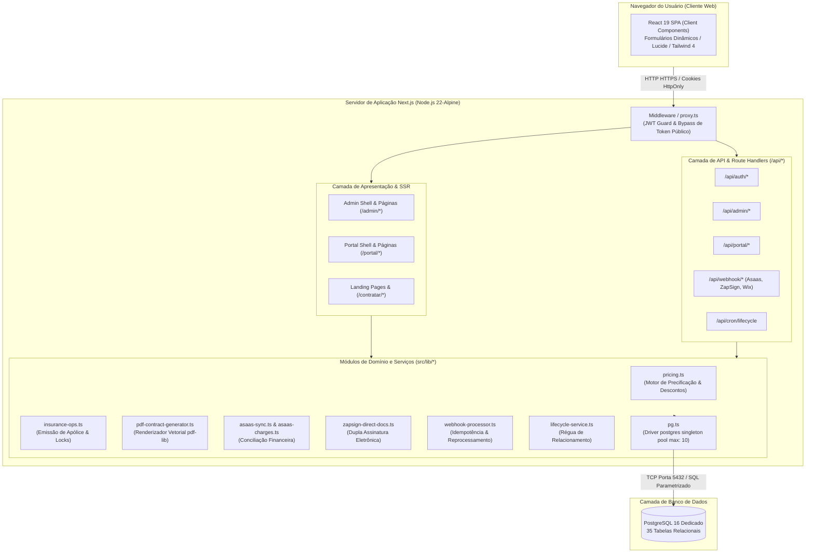
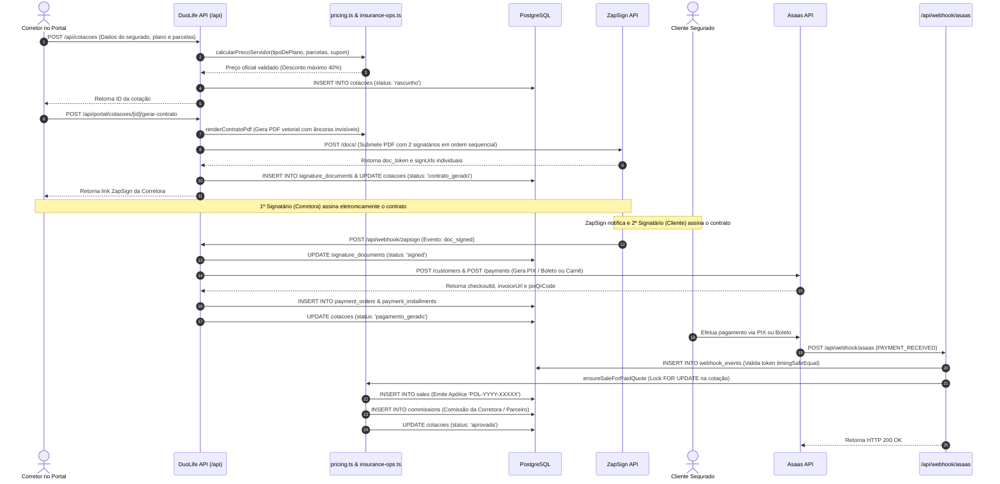

# Arquitetura do Sistema — DuoLife Hub

> **Status da Análise:** Fato Confirmado pelo Código-Fonte  
> **Classificação de Certeza:** Arquitetura real implementada no ecossistema DuoLife Hub.

---

## 1. Visão Geral da Arquitetura

O **DuoLife Hub** adota o padrão arquitetural de **Monólito Modular Moderno** construído sobre o framework **Next.js (App Router)** com execução no runtime Node.js v22. A aplicação consolida em um único repositório a interface pública de conversão, os portais operacionais autenticados (Admin e Parceiros), a camada de serviços de domínio e os endpoints de API RESTful que orquestram os gateways e integrações de terceiros.

A persistência de dados é centralizada em uma instância dedicada do **PostgreSQL 16**, acessada por meio de conexão nativa de alto desempenho via biblioteca `postgres` (Porsager) com suporte nativo a transações atômicas e consultas tipadas com *tagged template literals*.

---

## 2. Diagramas C4

### 2.1 Diagrama de Contexto de Sistema (C4 — Nível 1)

```mermaid
flowchart TB
    subgraph Atores ["Usuários do Sistema"]
        Cliente["Cliente / Proponente Segurado"]
        Corretor["Corretor de Seguros / Parceiro"]
        Admin["Equipe Interna DuoLife"]
    end

    subgraph DuoLifeHubSystem ["DuoLife Hub (Sistema Central)"]
        DuoLife["Plataforma DuoLife Hub\n(Next.js / TypeScript / Node.js 22)"]
    end

    subgraph SistemasExternos ["Sistemas & Serviços Externos"]
        WixAPI["Wix Data API v2\n(Catálogo de Planos & Espelho)"]
        ZapSignAPI["ZapSign API\n(Assinatura Eletrônica Avançada)"]
        AsaasAPI["Asaas Gateway v3\n(Cobranças PIX, Boleto e Cartão)"]
        EmailService["Net4Life Info / Nodemailer\n(Disparos de E-mail Transacionais)"]
        ViaCEPAPI["ViaCEP / BrasilAPI\n(Consulta de CEP e Endereços)"]
    end

    Cliente -->|Acessa Link Público / Assina / Paga| DuoLife
    Corretor -->|Simula / Emite Proposta / Gere Clientes| DuoLife
    Admin -->|Gerencia Corretoras / Sincronizações / Auditoria| DuoLife

    DuoLife -->|Consulta Catálogo & Leads| WixAPI
    DuoLife -->|Gera Minutas & Envia Assinaturas| ZapSignAPI
    ZapSignAPI -->|Notifica Assinatura (Webhook)| DuoLife
    DuoLife -->|Gera Faturas & Parcelamentos| AsaasAPI
    AsaasAPI -->|Notifica Liquidação (Webhook)| DuoLife
    DuoLife -->|Dispara Propostas & Cobranças| EmailService
    DuoLife -->|Autocompleta Endereço| ViaCEPAPI
```

---

### 2.2 Diagrama de Contêineres (C4 — Nível 2)



---

## 3. Fluxo de Execução das Principais Operações

O diagrama de sequência abaixo demonstra o fluxo completo de uma contratação, desde o início da proposta pelo corretor até a aprovação bancária e emissão da apólice definitiva:



---

## 4. Detalhamento dos Componentes Arquiteturais

### 4.1 Frontend e Camada de Interface
- **Next.js 16 (App Router):** Roteamento baseado em pastas com separação estrutural entre rotas públicas `(site)`, auto-contratação `/contratar/[token]`, portal autenticado do parceiro `/portal` e administração geral `/admin`.
- **Server Components por Padrão:** Todas as páginas realizam checagem de perfil e busca inicial de dados diretamente no servidor (`async Page()`), enviando apenas o HTML hidratado e JSON serializado ao navegador, maximizando a segurança contra exposição de queries.
- **Client Components (`'use client'`):** Utilizados pontualmente para formulários dinâmicos (`DynamicCotacaoForm.tsx`), gavetas interativas (`DescontoDrawer.tsx`), seletores de busca com debounce (`ClienteSearchSelector.tsx`) e componentes de tabela com ordenação e filtros em tempo real.
- **Design System Light Mode Estrito:** Cores fixadas em tokens no `globals.css` (`--surface: #f7faf9; --primary: #0e4a5a; --accent: #00d4e0;`). Bloqueio intencional de modo escuro via `color-scheme: light;`.

### 4.2 Backend e Serviços de Domínio
- **Motor de Precificação (`src/lib/pricing.ts`):** Centraliza o cálculo matemático de parcelamento, juros progressivos, deduções e aplicação de cupons. Bloqueia sumariamente valores alterados no client-side.
- **Operações de Seguro & Concorrência (`src/lib/insurance-ops.ts`):** Executa transações ACID via `sql.begin(async tx => ...)`. Utiliza `SELECT ... FOR UPDATE` para impedir que webhooks financeiros concorrentes gerem apólices duplicadas.
- **Gerador de Minutas em PDF (`src/lib/pdf-contract-generator.ts`):** Renderiza documentos em formato PDF puro no padrão gráfico institucional sem depender de navegadores headless (Puppeteer/Chromium), garantindo que a geração ocorra em menos de 100ms por minuta.
- **Processador Central de Webhooks (`src/lib/webhook-processor.ts`):** Decodifica payloads com parser defensivo contra double-encoding, persiste cabeçalhos saneados, controla contadores de retentativa e permite reexecução manual em 1 clique pelo painel administrativo.

### 4.3 Camada de Dados e Persistência
- **Driver `postgres` (Porsager):** Implementação singleton com pool configurado para `max: 10`, `idle_timeout: 20` e `connect_timeout: 10`.
- **Modelagem Relacional Híbrida:** 35 tabelas estruturadas com integridade referencial por chaves estrangeiras, combinadas com colunas `JSONB` (`client_data`, `metadata`, `address`, `permissions`) para suportar flexibilidade dinâmica de dados específicos de cada categoria profissional sem necessidade de migrações DDL contínuas.

### 4.4 Infraestrutura e DevOps
- **Contêiner Docker:** Imagem multi-estágio (`node:22-alpine`) gerando uma imagem de produção enxuta sem dependências de desenvolvimento.
- **Coolify:** Orquestração de deploy contínuo em servidor VPS dedicado com monitoramento de integridade via endpoint `/api/health`.
- **PostgreSQL Dedicado:** Instância isolada no Coolify (`duolife-postgres`), eliminando riscos de contenção de recursos de bancos compartilhados.
