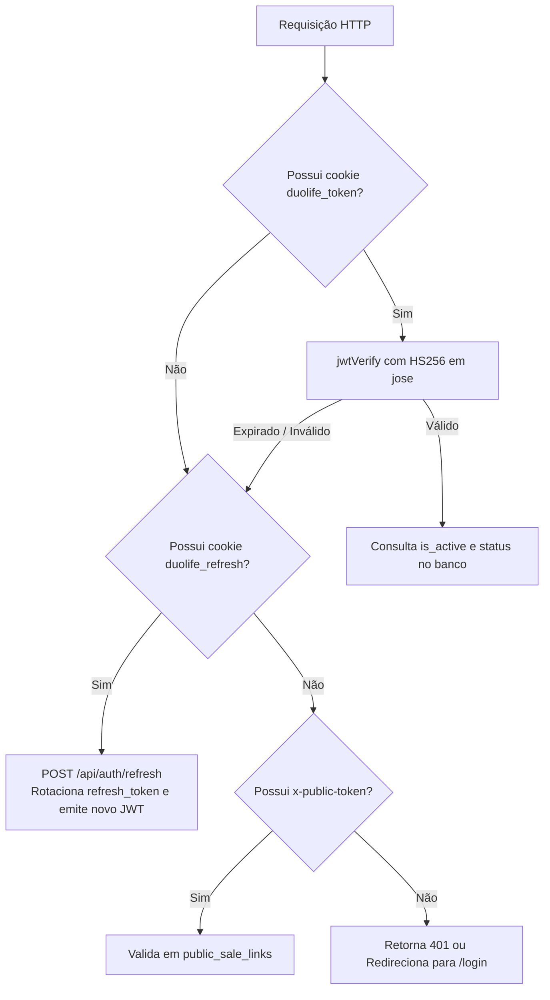

# Autenticação e Autorização — DuoLife Hub

> **Status da Análise:** Fato Confirmado pelo Código-Fonte  
> **Classificação de Certeza:** Implementação real extraída de `proxy.ts`, `src/lib/auth.ts`, `src/lib/roles.ts` e `src/lib/access.ts`.

---

## 1. Arquitetura de Autenticação

A arquitetura de autenticação do DuoLife Hub baseia-se no padrão **Stateful/Stateless Híbrido** com JSON Web Tokens (JWT) de curta duração acompanhados de Refresh Tokens rotativos de longa duração armazenados no banco de dados.



---

## 2. Ciclo de Vida de Credenciais e Sessão

### 2.1 Cookies de Autenticação
| Nome do Cookie | Duração | Escopo (Path) | Flags de Segurança | Finalidade |
|---|---|---|---|---|
| `duolife_token` | 8 horas | `/` | `HttpOnly`, `SameSite=Lax`, `Secure` (prod) | JWT de sessão contendo `userId`, `email`, `role`, `partnerId`, `corretoraId`. |
| `duolife_refresh` | 30 dias | `/api/auth` | `HttpOnly`, `SameSite=Lax`, `Secure` (prod) | Token opaco de renovação de sessão. |

### 2.2 Assinatura e Criptografia
- **Algoritmo JWT:** `HS256` utilizando a biblioteca `jose`. O segredo é derivado de `JWT_SECRET` via `getEncodedJwtSecret()`.
- **Armazenamento de Senhas:** Hashes unidirecionais gerados com `bcryptjs` utilizando fator de custo de **10 salt rounds**.
- **Rotação de Refresh Tokens:** O valor cru do refresh token nunca é salvo no banco de dados; apenas o seu hash SHA-256 (`token_hash`) é persistido na tabela `refresh_tokens`. A cada renovação bem-sucedida, o token utilizado é marcado como `revoked = true` e um novo token é emitido.

---

## 3. Middleware de Borda (`proxy.ts`)

O arquivo `proxy.ts` intercepta todas as requisições antes que atinjam as páginas ou rotas de API:

### 3.1 Regras de Bloqueio por Rota
1. **Rotas Administrativas (`/admin` e `/api/admin`):**
   - Exige estritamente cookie `duolife_token` válido.
   - O payload do JWT deve conter um papel que inicie com `duolife_` (`role.startsWith('duolife_')`).
   - Se inválido ou ausente: retorna HTTP 401/403 para APIs ou redireciona o navegador para `/login`.
2. **Rotas de Negócio e Portal (`/portal`, `/api/portal`, `/api/cotacoes`, etc.):**
   - **Bypass de Token Público:** Se a requisição contiver o cabeçalho `x-public-token` para rotas de cotação ou portal, a passagem é autorizada sem exigir sessão de usuário.
   - Caso não seja token público, exige cookie de sessão com papel válido (`duolife_*`, `corretora_*` ou `partner_*`).

---

## 4. Camada de Autorização e RBAC

A autorização diferencia formalmente **quem o usuário é** (autenticação) de **quais dados ele pode visualizar ou manipular** (autorização).

### 4.1 Predicados de Papel (`src/lib/roles.ts`)
```typescript
export function roleIsInternal(role: string): boolean {
  return ['duolife_dev', 'duolife_admin', 'duolife_staff'].includes(role);
}

export function roleIsCorretora(role: string): boolean {
  return ['corretora_admin', 'corretora_manager', 'corretora_staff'].includes(role);
}

export function roleIsPlatformAdmin(role: string): boolean {
  return role === 'duolife_dev' || role === 'duolife_admin';
}

export function roleIsDev(role: string): boolean {
  return role === 'duolife_dev';
}
```

### 4.2 Isolamento de Dados por Tenant (`src/lib/access.ts`)
Mesmo que um corretor esteja autenticado com sucesso, ele não possui autorização para consultar dados de outra corretora ou outro parceiro. A função `getAccessibleQuoteById` aplica filtros rigorosos:
- Se for usuário interno (`isInternalUser`): tem acesso global a qualquer cotação.
- Se for usuário de corretora: restrito estritamente a cotações com `corretora_id = access.corretoraId`.
- Se for diretor de parceiro: restrito a cotações com `partner_id = access.partnerId`.
- Se for corretor/vendedor: restrito a cotações vinculadas ao seu `partner_user_id`.

---

## 5. Inconsistências de Segurança e Autorização Mapeadas

1. **Divergência entre Frontend e Backend em `/api/vendas` e `/api/comissoes`:**
   - *Comportamento:* A interface administrativa de vendas exibe todas as apólices nacionais utilizando Server Components (`getAdminDashboardData`). No entanto, o endpoint REST `/api/vendas` utiliza `verifyPartnerAuth`, rejeitando requisições de administradores internos com HTTP 401.
2. **Bypass de Middleware Amplo para `/api/portal`:**
   - *Comportamento:* O middleware `proxy.ts` autoriza a passagem de requisições com `x-public-token` para qualquer rota que inicie com `/api/portal`. Sub-rotas que exigem perfil administrativo de corretora (como `/api/portal/equipe`) dependem exclusivamente de validações no próprio endpoint para não serem executadas de forma anônima.
