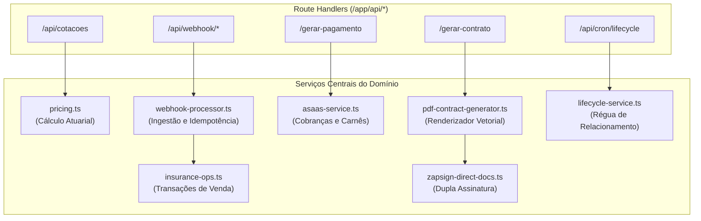

# Arquitetura Backend & Serviços — DuoLife Hub

> **Status da Análise:** Fato Confirmado pelo Código-Fonte  
> **Classificação de Certeza:** Implementação técnica real do runtime Node.js e serviços de domínio.

---

## 1. Ambiente de Execução e Bootstrap

- **Runtime:** Node.js v22 (imagem base `node:22-alpine`).
- **Framework Web:** Next.js `16.3.4` (Route Handlers em `app/api/**/route.ts`).
- **Linguagem:** TypeScript 5 compilado nativamente pelo Turbopack.
- **Ciclo de Inicialização do Servidor (`npm run start`):**
  1. O script de inicialização executa `node scripts/migrate.mjs`.
  2. O script conecta ao PostgreSQL, cria a tabela de controle `schema_migrations` e aplica sequencialmente todas as migrações SQL pendentes de `db/migrations/` em transações atômicas isoladas.
  3. Após a conclusão bem-sucedida das migrações, o processo inicia o servidor Next.js em produção (`next start`).
  4. Na primeira requisição atendida pelo servidor, o singleton `src/lib/schema.ts` executa a validação de presença das tabelas de catálogo.

---

## 2. Camada de Acesso a Dados e Conexão (`src/lib/pg.ts`)

A persistência de dados utiliza a biblioteca `postgres` (Porsager), conhecida por sua alta performance e ausência de dependências de compiladores nativos C/C++:

```typescript
// src/lib/pg.ts
global._pg = postgres(url, { 
  max: 10,              // Limite máximo de 10 conexões no pool
  idle_timeout: 20,     // Descarta conexões ociosas após 20 segundos
  connect_timeout: 10   // Timeout de conexão de 10 segundos
});
```

### 2.1 Padrão de Consultas e Transações
- **Tagged Template Literals:** Todas as consultas utilizam a sintaxe nativa `` await sql`SELECT ... WHERE id = ${id}` ``, onde os valores são convertidos internamente em parâmetros binários posicionais (`$1, $2, ...`), garantindo imunidade total a SQL Injection.
- **Transações ACID:** Operações de mutação crítica utilizam o gerenciador de transação `sql.begin(async (tx) => { ... })`. Se qualquer exceção for lançada dentro do bloco, o driver executa automaticamente o `ROLLBACK`.

---

## 3. Serviços de Domínio do Backend (`src/lib/`)



### 3.1 Motor de Precificação (`pricing.ts`)
- Recalcula o prêmio a partir das tabelas oficiais vigentes, ignorando quaisquer valores informados pelo cliente.
- Aplica taxas de juros progressivas por quantidade de parcelas (1x a 6x).
- Trava desconto manual em no máximo 40%.
- Bloqueia parcelamento para planos simplificados de 100k.

### 3.2 Operações de Seguro & Lock Concorrente (`insurance-ops.ts`)
- Executa a função `ensureSaleForPaidQuote` com lock pessimista:
  ```sql
  SELECT id FROM cotacoes WHERE id = ${cotacaoId} FOR UPDATE;
  ```
- Garante que a apólice oficial (`sales`) seja gerada uma única vez, calculando a alíquota de IOF legal de 7,38% e o comissionamento hierárquico da corretora e do parceiro.

### 3.3 Renderizador Vetorial de PDFs (`pdf-contract-generator.ts`)
- Utiliza a biblioteca `pdf-lib` para desenhar contratos do zero.
- Aplica cálculo dinâmico de altura de texto (`drawTextCard`) e quebra automática de linha (`wrapText`) para impedir truncamento de cláusulas legais.
- Aplica duas âncoras invisíveis de texto (`{{assinatura_corretora}}` e `{{assinatura_proponente}}`) para o mapeamento da ZapSign.

### 3.4 Processador Central de Webhooks (`webhook-processor.ts`)
- Normalizador multi-nível contra payloads com double-encoding.
- Mecanismo de persistência de cabeçalhos saneados (removendo chaves e senhas antes de gravar no banco).
- Rastreamento de retentativas (`retry_count`) e suporte a reprocessamento manual ou em lote.

### 3.5 Régua de Relacionamento & Lifecycle (`lifecycle-service.ts`)
- Processa diariamente as janelas de renovação de contratos em **D-60, D-30, D-15 e D-0**.
- Notifica corretores e segurados sobre parcelas a vencer em **D-3 e D-1** e parcelas em atraso em **D+1, D+3, D+7 e D+15**.
- Grava cada disparo nas tabelas de controle de notificação, garantindo total idempotência diária.

---

## 4. Tarefas Agendadas (Cronjobs)

O sistema possui uma rota de execução agendada:
- **Rota:** `POST /api/cron/lifecycle` (ou `GET` para disparo de monitoramento).
- **Proteção:** Header `Authorization: Bearer <CRON_SECRET>` validado contra a variável de ambiente `CRON_SECRET`.
- **Telemetria:** Cada ciclo de execução registra a quantidade de apólices varridas, notificações disparadas, erros e a duração em milissegundos na tabela `lifecycle_cron_logs`.

---

## 5. Sistema de Logs e Telemetria (`src/lib/logger.ts`)

- Instanciado a partir da biblioteca **Pino** (`pino ^10.3.1`).
- Produz logs estruturados em formato JSON com níveis semânticos:
  - `logger.info`: Eventos operacionais normais (início de sincronização, cotação criada, webhook recebido).
  - `logger.warn`: Anomalias recuperáveis (tentativa de desconto acima do limite truncada, falha de validação Zod não impeditiva).
  - `logger.error`: Falhas de sistema (erro de comunicação externa com APIs, exceção em transação de banco).
