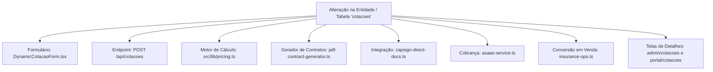
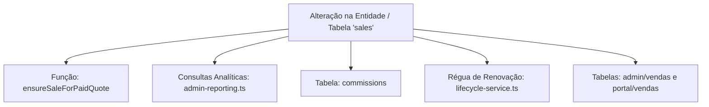
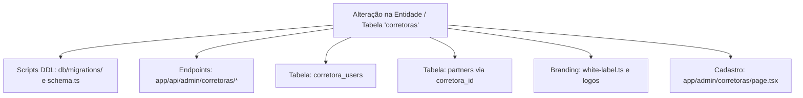

# Guia de Impacto de Alterações — DuoLife Hub

> **Status da Análise:** Fato Confirmado pelo Código-Fonte  
> **Classificação de Certeza:** Mapeamento de dependências cruzadas entre frontend, backend, APIs e banco de dados.

---

## 1. Finalidade deste Guia

Este guia orienta engenheiros de software e agentes autônomos de IA na avaliação de risco e efeito colateral antes de realizar modificações no código-fonte ou no banco de dados do DuoLife Hub.

---

## 2. Mapas de Impacto por Domínio

### 2.1 Alterações na Entidade `cotacoes` (Propostas / Cotações)

**Checklist de Validação Obrigatória:**
1. **Schema Zod:** Se adicionar campos obrigatórios em `client_data` ou no nível raiz de `cotacoes`, atualize `app/api/cotacoes/route.ts` garantindo o uso de `.nullable()` ou `.optional()` para não quebrar propostas em andamento.
2. **Formulário Dinâmico:** Atualize o estado inicial `initialMultiRamoFormState` e a validação do passo em `DynamicCotacaoForm.tsx`.
3. **Contrato PDF:** Se o campo for jurídico ou atuarial (ex: titularidade, escritório, seguro anterior), atualize a função de extração e desenho no `src/lib/pdf-contract-generator.ts`.
4. **Templates ZapSign:** Se o modelo for emitido via template legado, adicione a variável correspondente no payload enviado à ZapSign.
5. **Locks e Concorrência:** Verifique se a query em `insurance-ops.ts` (`SELECT ... FOR UPDATE`) continua cobrindo os campos alterados.

---

### 2.2 Alterações na Entidade `sales` (Apólices & Vendas)

**Checklist de Validação Obrigatória:**
1. **Competência de Emissão:** Consultas analíticas devem utilizar `COALESCE(s.issue_date, s.created_at::date)` para filtrar vendas por competência real de emissão da apólice, nunca por data de inserção técnica no banco.
2. **Filtro de Cancelamento:** Toda agregação deve conter `s.status != 'cancelada'`.
3. **Cálculo de Comissões:** Lembre-se de que a comissão é calculada sobre o **prêmio líquido** (descontando 7,38% de IOF), e não sobre o prêmio bruto.
4. **Régua de Renovação:** O serviço `lifecycle-service.ts` varre apólices com base na coluna `expiry_date`. Nunca altere essa coluna para tipos diferentes de `DATE`.

---

### 2.3 Alterações na Entidade `corretoras`

**Checklist de Validação Obrigatória:**
1. **Schema DDL:** Qualquer nova coluna deve ser declarada tanto na próxima migração SQL em `db/migrations/` quanto na função `runRuntimeSchemaSetup()` em `src/lib/schema.ts` via `ALTER TABLE corretoras ADD COLUMN IF NOT EXISTS ...`.
2. **Validação de Uploads:** O cadastro de corretora exige 4 uploads em Base64. Se alterar as restrições, atualize o schema Zod em `app/api/admin/corretoras/route.ts` e as rotas de download em `app/api/admin/corretoras/[id]/documento/[tipo]`.
3. **Isolamento de Tenant:** Verifique se as novas colunas não afetam o resolver `getCorretoraParaContrato()` usado na geração de minutas em PDF.

---

### 2.4 Alterações no Catálogo de Produtos e Ramos (`src/lib/product-schemas/`)

**Checklist de Validação Obrigatória:**
1. **Compatibilidade Case-Insensitive:** O identificador do plano 100k simplificado deve ser verificado com suporte a variações de maiúsculas/minúsculas (`isPlano100k`).
2. **Parcelamento:** Planos de 100k não admitem parcelamento (`maxParcelas === 1`). Se criar novos produtos com essa regra, garanta a trava no motor `pricing.ts`.
3. **Templates de Contrato:** Cada novo ramo requer alinhamento do questionário atuarial com o gerador de PDF `pdf-contract-generator.ts`.

---

### 2.5 Alterações em Webhooks e Gateway de Pagamento (Asaas)

**Checklist de Validação Obrigatória:**
1. **Comparação Timing-Safe:** Nunca compare tokens de webhook com `===`. Utilize sempre `crypto.timingSafeEqual` via `src/lib/webhook-auth.ts`.
2. **Anti-Replay:** Garanta que o identificador do evento seja gravado em `webhook_events` antes de acionar a transação de negócio.
3. **Prevenção de Anacronismo:** Nunca vincule cobranças do Asaas a cotações sem antes validar se a data de criação da cobrança é contemporânea à proposta (`isChargeAnachronic`).
4. **Disparo de Gatilhos:** Eventos de domínio (ex: `PAGAMENTO_CONFIRMADO`) só devem ser disparados na primeira liquidação (`sale.created === true`), nunca no pagamento de parcelas subsequentes de carnês.

---

## 3. Matriz Rápida de Dependências Cruzadas

| Arquivo Alterado | Também Deve ser Verificado / Testado |
|---|---|
| `src/lib/pricing.ts` | `DynamicCotacaoForm.tsx`, `/api/cotacoes`, `scripts/test-pricing-multi-ramo.ts` |
| `src/lib/insurance-ops.ts` | `/api/webhook/asaas`, `admin-reporting.ts`, `commissions`, `sales` |
| `src/lib/pdf-contract-generator.ts` | `scripts/test-novos-modelos-contrato.ts`, `zapsign-direct-docs.ts` |
| `src/lib/asaas-sync.ts` | `/api/admin/sync/*`, `/api/portal/sincronizar-asaas`, `payment_orders` |
| `src/lib/roles.ts` | `proxy.ts`, `src/lib/auth.ts`, `src/lib/access.ts`, `AdminShell.tsx` |
| `src/lib/schema.ts` | `scripts/migrate.mjs`, `db/migrations/`, `test-db-connection.mjs` |
