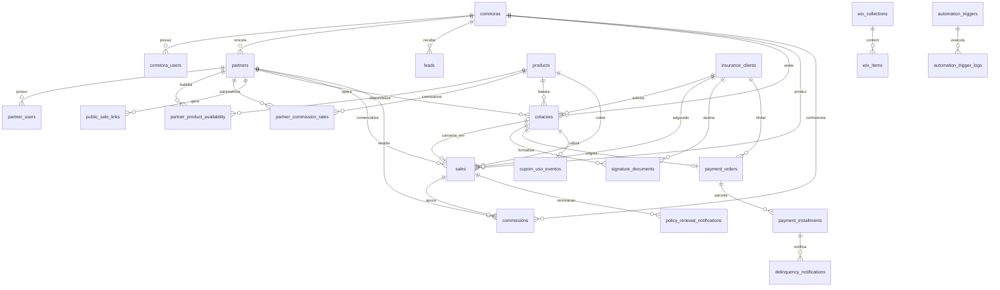

# Engenharia Reversa de Banco de Dados — DuoLife Hub

> **Status da Análise:** Fato Confirmado pelo Código-Fonte  
> **Classificação de Certeza:** Auditoria técnica de 35 tabelas, 20 migrações SQL e scripts de runtime.

---

## 1. Visão Geral da Modelagem de Dados

O banco de dados do **DuoLife Hub** é executado sobre o **PostgreSQL 16**. A arquitetura de dados combina modelagem relacional estrita (tabelas normalizadas para entidades financeiras, cadastrais e de controle) com estruturas híbridas em colunas **JSONB** (`client_data`, `metadata`, `address`, `permissions`, `tree_definition`), proporcionando flexibilidade para questionários atuariais que variam conforme a especialidade profissional do segurado.

---

## 2. Diagrama Entidade-Relacionamento (ER Mermaid)



---

## 3. Catálogo e Dicionário de Tabelas do Banco de Dados

Abaixo está o inventário técnico completo das **35 tabelas** mapeadas no sistema:

### 3.1 Núcleo de Usuários, Corretoras e Parceiros

#### `admin_users`
- **Finalidade:** Operadores internos e desenvolvedores da DuoLife.
- **Chave Primária (PK):** `id TEXT DEFAULT gen_random_uuid()::text`.
- **Campos Principais:** `name TEXT NOT NULL`, `email TEXT UNIQUE NOT NULL`, `password_hash TEXT NOT NULL`, `role TEXT NOT NULL DEFAULT 'staff'`, `is_active BOOLEAN NOT NULL DEFAULT true`.
- **Estratégia de Exclusão:** Soft delete via `is_active = false`.

#### `corretoras`
- **Finalidade:** Empresas corretoras parceiras credenciadas (multi-tenant B2B).
- **Chave Primária (PK):** `id TEXT DEFAULT gen_random_uuid()::text`.
- **Campos Principais:** `razao_social TEXT NOT NULL`, `nome_fantasia TEXT NOT NULL`, `cnpj TEXT UNIQUE`, `susep TEXT`, `email TEXT NOT NULL`, `status TEXT NOT NULL DEFAULT 'active'`, `banco TEXT`, `agencia TEXT`, `conta TEXT`, `pix_tipo_chave TEXT`, `pix_chave TEXT`.
- **Armazenamento de Arquivos em Base64:** `logo_base64`, `contrato_social_base64`, `cartao_cnpj_base64`, `socio_documento_base64`, `comprovante_bancario_base64` acompanhados de metadados (`mime_type`, `nome_arquivo`, `uploaded_at`).
- **Índices:** `idx_corretoras_cnpj`, `idx_corretoras_status`.

#### `corretora_users`
- **Finalidade:** Gestores e colaboradores de uma corretora master.
- **Chave Primária (PK):** `id TEXT DEFAULT gen_random_uuid()::text`.
- **Chave Estrangeira (FK):** `corretora_id REFERENCES corretoras(id) ON DELETE CASCADE`.
- **Constraints:** `UNIQUE (email)`.

#### `partners`
- **Finalidade:** Empresas parceiras comerciais e corretores pessoas físicas.
- **Chave Primária (PK):** `id TEXT DEFAULT gen_random_uuid()::text`.
- **Chave Estrangeira (FK):** `corretora_id REFERENCES corretoras(id)`.
- **Campos:** `razao_social TEXT NOT NULL`, `person_type TEXT NOT NULL DEFAULT 'pj'`, `cnpj TEXT UNIQUE`, `cpf TEXT`, `status TEXT NOT NULL DEFAULT 'pending'`.
- **Índices:** `partners_cpf_key (UNIQUE WHERE cpf IS NOT NULL)`, `idx_partners_corretora_id`.

#### `partner_users`
- **Finalidade:** Corretores e vendedores subordinados a um parceiro.
- **Chave Primária (PK):** `id TEXT DEFAULT gen_random_uuid()::text`.
- **Chaves Estrangeiras (FKs):**
  - `partner_id REFERENCES partners(id)`.
  - `manager_user_id REFERENCES partner_users(id)` (auto-relacionamento de hierarquia).
- **Constraints:** `UNIQUE (email)`.

---

### 3.2 Catálogo de Produtos e Comissionamento

#### `products`
- **Finalidade:** Catálogo de seguros (RC Profissional) e serviços distribuídos.
- **Chave Primária (PK):** `id TEXT DEFAULT gen_random_uuid()::text`.
- **Campos Principais:** `name TEXT NOT NULL`, `code TEXT UNIQUE NOT NULL`, `category TEXT NOT NULL`, `base_commission_rate NUMERIC(5,2)`, `product_type TEXT DEFAULT 'insurance'`, `flow_key TEXT DEFAULT 'rc_professional_v1'`, `pricing_strategy TEXT DEFAULT 'rc_wix_planos_v1'`, `policy_prefix TEXT`, `is_active BOOLEAN DEFAULT true`.

#### `partner_product_availability`
- **Finalidade:** Tabela de habilitação comercial de produtos por parceiro (matriz N:M).
- **Chave Primária (PK):** Composta `(partner_id, product_id)`.
- **Chaves Estrangeiras (FKs):** `partner_id REFERENCES partners(id)`, `product_id REFERENCES products(id)`.

#### `partner_commission_rates`
- **Finalidade:** Histórico e vigência de taxas diferenciadas de comissão por produto e parceiro.
- **Chave Primária (PK):** Composta `(partner_id, product_id, valid_from)`.
- **Campos:** `rate NUMERIC(5,2) NOT NULL`, `valid_from DATE NOT NULL`, `valid_until DATE`.

---

### 3.3 Esteira Comercial, Segurados e Apólices

#### `insurance_clients`
- **Finalidade:** Cadastro consolidado dos clientes segurados (titulares de apólices).
- **Chave Primária (PK):** `id TEXT DEFAULT gen_random_uuid()::text`.
- **Constraints:** `UNIQUE (document_number)` (garante unicidade estrita por CPF/CNPJ).
- **Campos:** `document_number TEXT NOT NULL`, `document_type TEXT DEFAULT 'cpf'`, `full_name TEXT NOT NULL`, `email TEXT`, `phone TEXT`, `metadata JSONB`.

#### `cotacoes`
- **Finalidade:** Propostas de seguros em elaboração ou submetidas para assinatura.
- **Chave Primária (PK):** `id TEXT DEFAULT gen_random_uuid()::text`.
- **Chaves Estrangeiras (FKs):**
  - `client_id REFERENCES insurance_clients(id)`.
  - `partner_id REFERENCES partners(id)`.
  - `partner_user_id REFERENCES partner_users(id)`.
  - `product_id REFERENCES products(id)`.
  - `lead_id REFERENCES leads(id)`.
  - `corretora_id REFERENCES corretoras(id)`.
  - `renewed_from_cotacao_id REFERENCES cotacoes(id)` (auto-relacionamento de renovação).
- **Campos Principais:** `client_data JSONB NOT NULL DEFAULT '{}'`, `importancia_segurada NUMERIC(12,2)`, `premio_calculado NUMERIC(12,2)`, `premio_final NUMERIC(12,2)`, `status TEXT NOT NULL DEFAULT 'rascunho'`, `is_renewal BOOLEAN DEFAULT false`, `source_token TEXT`.
- **Índices:** `cotacoes_partner_id`, `cotacoes_status`, `cotacoes_client_id`, `idx_cotacoes_corretora_id`.

#### `sales`
- **Finalidade:** Apólices formais emitidas e negócios concretizados.
- **Chave Primária (PK):** `id TEXT DEFAULT gen_random_uuid()::text`.
- **Chaves Estrangeiras (FKs):**
  - `cotacao_id REFERENCES cotacoes(id)`.
  - `client_id REFERENCES insurance_clients(id)`.
  - `partner_id REFERENCES partners(id)`.
  - `product_id REFERENCES products(id)`.
  - `corretora_id REFERENCES corretoras(id)`.
- **Constraints:** `UNIQUE (policy_number)`.
- **Campos:** `policy_number TEXT UNIQUE`, `importancia_segurada NUMERIC(12,2)`, `premio_total NUMERIC(12,2)`, `commission_rate NUMERIC(5,2)`, `commission_amount NUMERIC(12,2)`, `status TEXT DEFAULT 'ativa'`, `issue_date DATE NOT NULL`, `expiry_date DATE NOT NULL`.

#### `commissions`
- **Finalidade:** Lançamentos de comissões devidas aos parceiros comerciais pelas apólices.
- **Chave Primária (PK):** `id TEXT DEFAULT gen_random_uuid()::text`.
- **Chaves Estrangeiras (FKs):**
  - `sale_id REFERENCES sales(id)`.
  - `partner_id REFERENCES partners(id)`.
  - `corretora_id REFERENCES corretoras(id)`.
- **Campos:** `amount NUMERIC(12,2) NOT NULL`, `rate NUMERIC(5,2) NOT NULL`, `status TEXT DEFAULT 'pendente'`, `reference_month TEXT`.

#### `leads`
- **Finalidade:** Contatos comerciais captados no site ou sincronizados do Wix.
- **Chave Primária (PK):** `id TEXT DEFAULT gen_random_uuid()::text`.
- **Campos:** `external_id TEXT`, `document_number TEXT`, `nome TEXT`, `email TEXT`, `telefone TEXT`, `status TEXT DEFAULT 'novo'`, `status_cliente TEXT` (granularidade Wix/NET4Life: Vigente, Em atraso, Cancelado).

---

### 3.4 Assinatura Digital e Pagamentos

#### `signature_documents`
- **Finalidade:** Documentos e envelopes de assinatura eletrônica na ZapSign.
- **Chave Primária (PK):** `id TEXT DEFAULT gen_random_uuid()::text`.
- **Chaves Estrangeiras (FKs):** `cotacao_id REFERENCES cotacoes(id)`, `client_id REFERENCES insurance_clients(id)`.
- **Constraints:** `UNIQUE (provider, external_document_id)`.
- **Índice Condicional de Unicidade:**
  ```sql
  CREATE UNIQUE INDEX signature_documents_unique_active_cotacao 
  ON signature_documents (cotacao_id) 
  WHERE status NOT IN ('cancelled', 'refused', 'expired');
  ```

#### `payment_orders`
- **Finalidade:** Ordens de pagamento consolidadas (carnê/cobrança) no Asaas.
- **Chave Primária (PK):** `id TEXT DEFAULT gen_random_uuid()::text`.
- **Constraints:** `UNIQUE (cotacao_id)`.
- **Campos:** `provider TEXT DEFAULT 'asaas'`, `external_payment_id TEXT`, `external_installment_id TEXT`, `status TEXT DEFAULT 'pending'`, `amount_total NUMERIC(12,2)`, `installment_count INT DEFAULT 1`, `paid_installments INT DEFAULT 0`, `paid_amount NUMERIC(12,2) DEFAULT 0`.

#### `payment_installments`
- **Finalidade:** Parcelas e boletos individuais vinculados a uma ordem de cobrança.
- **Chave Primária (PK):** `id TEXT DEFAULT gen_random_uuid()::text`.
- **Chave Estrangeira (FK):** `payment_order_id REFERENCES payment_orders(id) ON DELETE CASCADE`.
- **Constraints:** `UNIQUE (provider, external_payment_id)`.
- **Campos:** `installment_number INT DEFAULT 1`, `status TEXT DEFAULT 'pending'`, `amount NUMERIC(12,2)`, `net_amount NUMERIC(12,2)`, `due_date DATE`, `paid_at TIMESTAMPTZ`, `invoice_url TEXT`, `bank_slip_url TEXT`, `pix_qr_code_url TEXT`.

---

### 3.5 Integrações, Webhooks e Sessões

#### `webhook_events`
- **Finalidade:** Repositório de eventos de webhook para auditoria, resiliência e reprocessamento.
- **Campos:** `provider TEXT NOT NULL`, `event_type TEXT`, `external_id TEXT`, `payload JSONB NOT NULL DEFAULT '{}'`, `request_headers JSONB`, `processed BOOLEAN DEFAULT false`, `retry_count INT DEFAULT 0`, `last_retried_at TIMESTAMPTZ`, `error_message TEXT`.

#### `public_sale_links`
- **Finalidade:** Links parametrizados com tokens para auto-contratação white-label.
- **Constraints:** `UNIQUE (token)`.
- **Campos:** `partner_id REFERENCES partners(id)`, `token TEXT UNIQUE NOT NULL`, `discount_percent INT DEFAULT 0`, `status TEXT DEFAULT 'active'`, `expires_at TIMESTAMPTZ`.

#### `refresh_tokens`
- **Finalidade:** Sessões de longa duração (30 dias) com rotação automática de chaves.
- **Constraints:** `UNIQUE (token_hash)`.
- **Campos:** `partner_user_id TEXT NOT NULL`, `token_hash TEXT NOT NULL`, `expires_at TIMESTAMPTZ NOT NULL`, `revoked BOOLEAN DEFAULT false`.
- **Anomalia Conhecida:** A restrição FK `refresh_tokens_partner_user_id_fkey` foi removida intencionalmente na migração 013 para permitir o armazenamento polimórfico de IDs tanto de `partner_users` quanto de `corretora_users`.

#### `password_reset_tokens`
- **Finalidade:** Tokens seguros de recuperação de senha com validade temporária (2 horas).
- **Campos:** `user_id TEXT NOT NULL`, `user_type TEXT NOT NULL`, `token_hash TEXT UNIQUE NOT NULL`, `expires_at TIMESTAMPTZ NOT NULL`, `used BOOLEAN DEFAULT false`.

#### `system_settings`
- **Finalidade:** Configurações dinâmicas e parâmetros de integração em texto plano.
- **Chave Primária (PK):** `key TEXT PRIMARY KEY`.
- **Campos:** `value TEXT NOT NULL`, `description TEXT`, `updated_at TIMESTAMPTZ DEFAULT NOW()`.

---

### 3.6 E-mails, Automações e Ciclo de Vida

- `email_templates`: Modelos de mensagens transacionais com suporte a variáveis (`design_json`, `body_html`, `subject`).
- `email_dispatch_logs`: Trilha de auditoria de cada disparo efetuado com status e payload.
- `automation_triggers`: Configuração de árvores de decisão e gatilhos de eventos (`tree_definition JSONB`).
- `automation_trigger_logs`: Histórico de execução de regras automatizadas e nós avaliados.
- `policy_renewal_notifications`: Disparos de renovação de apólices com constraint `UNIQUE (sale_id, window_days, target_date)`.
- `delinquency_notifications`: Disparos de cobrança de inadimplência com constraint `UNIQUE (installment_id, notification_type, trigger_day)`.
- `lifecycle_cron_logs`: Telemetria de execução diária do agendador de ciclo de vida.
- `wix_collections` & `wix_items`: Espelho das coleções remotas do Wix com hash SHA-256 de detecção de alterações.
- `cupom_usos` & `cupom_uso_eventos`: Tabelas modeladas para contagem atômica de cupons. **Atenção:** A auditoria adversarial comprovou que nenhuma rota do sistema executa `INSERT` ou `UPDATE` nessas tabelas; o contador nunca incrementa e os limites de uso de cupons nunca são decrementados.
- `sync_log`: Log polimórfico de sincronização bidirecional.
- `schema_migrations`: Controle de migrações SQL executadas pelo script de deploy.

---

## 4. Diagnóstico de Inconsistências e Anomalias de Banco de Dados

1. **Dualidade de Governança DDL:** O sistema executa simultaneamente migrações versionadas em `scripts/migrate.mjs` e comandos DDL dinâmicos em `src/lib/schema.ts` (`ensureSchema()`). O `ensureSchema` emite dezenas de `ALTER TABLE` a cada inicialização em desenvolvimento, aumentando o risco de *locks* concorrentes.
2. **Armazenamento Inline de Arquivos Base64 na Tabela `corretoras`:** O armazenamento de 5 arquivos (PDFs de contrato social, comprovantes bancários e documentos de sócios) em colunas de texto gera inchaço (*table bloat*) no PostgreSQL e alocação de tabelas TOAST.
3. **Padrão de Tipagem de Chaves:** O uso de `TEXT DEFAULT gen_random_uuid()::text` ocupa 36 bytes por identificador, consumindo mais que o dobro dos 16 bytes do tipo nativo `UUID`.
4. **Scripts de Reparo de Valores (* 100) em Runtime:** O bloco de correção de valores corrompidos históricos em `schema.ts` executa varreduras textuais com `ILIKE` na inicialização, gerando risco de truncamento indevido de propostas legítimas de alto valor no futuro.
5. **Divergência Contábil em `payment_orders.amount_total`:** Em cobranças parceladas, a coluna `amount_total` grava o valor à vista (`valorTotal`), enquanto o Asaas cobra as parcelas com acréscimo. Consequentemente, `paid_amount` pode ultrapassar `amount_total` após a liquidação integral.
6. **Fallback Hardcoded de Tenant (`corretora_net4life_001`):** Scripts em `schema.ts` forçam `UPDATE sales SET corretora_id = 'corretora_net4life_001' WHERE corretora_id IS NULL`, comprometendo a neutralidade do modelo multi-tenant para vendas diretas sem corretora vinculada.
7. **Tabelas Órfãs sem Escrita (`cupom_usos` e `cupom_uso_eventos`):** Embora criadas e indexadas no PostgreSQL, não há nenhuma chamada no backend para persistir ou incrementar o uso de cupons no momento do fechamento da venda.
