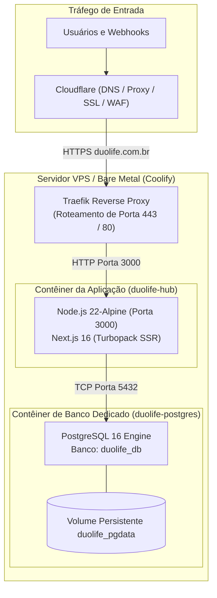

# Deploy, Infraestrutura & DevOps — DuoLife Hub

> **Status da Análise:** Fato Confirmado pelo Código-Fonte  
> **Classificação de Certeza:** Configurações reais de Dockerfile, docker-compose, scripts de inicialização e ambiente Coolify.

---

## 1. Topologia de Infraestrutura de Produção

A infraestrutura de produção do DuoLife Hub opera sobre um servidor dedicado gerenciado via **Coolify** (PaaS auto-hospedado):



---

## 2. Especificação do Dockerfile Multi-Estágio

O arquivo `Dockerfile` na raiz do projeto implementa o padrão multi-stage build otimizado para o Next.js:

```dockerfile
FROM node:22-alpine AS base

# Estágio 1: Dependências
FROM base AS deps
RUN apk add --no-cache libc6-compat
WORKDIR /app
COPY package.json package-lock.json* ./
RUN npm ci

# Estágio 2: Build da Aplicação
FROM base AS builder
WORKDIR /app
COPY --from=deps /app/node_modules ./node_modules
COPY . .
ENV NEXT_TELEMETRY_DISABLED=1
ENV NODE_ENV=production
RUN npm run build

# Estágio 3: Runner Final de Produção (Enxuto)
FROM base AS runner
WORKDIR /app
ENV NODE_ENV=production
ENV NEXT_TELEMETRY_DISABLED=1
ENV PORT=3000
ENV HOSTNAME="0.0.0.0"

# Usuário não-root por segurança
RUN addgroup --system --gid 1001 nodejs && \
    adduser --system --uid 1001 nextjs

COPY --from=builder /app/public ./public
COPY --from=builder /app/.next ./.next
COPY --from=builder /app/node_modules ./node_modules
COPY --from=builder /app/package.json ./package.json
COPY --from=builder /app/scripts ./scripts
COPY --from=builder /app/db ./db

USER nextjs
EXPOSE 3000
CMD ["npm", "run", "start"]
```

---

## 3. Fluxo de Inicialização e Migração Automática

O comando de inicialização `npm run start` está configurado no `package.json` para executar o script de migrações antes de subir o servidor web:
```json
"start": "node scripts/migrate.mjs && next start"
```

### 3.1 Funcionamento de `scripts/migrate.mjs`
1. Conecta ao PostgreSQL utilizando a variável `DATABASE_URL` com limite de 1 conexão (`max: 1`).
2. Garante a existência da tabela `schema_migrations`:
   ```sql
   CREATE TABLE IF NOT EXISTS schema_migrations (
     name TEXT PRIMARY KEY,
     applied_at TIMESTAMPTZ NOT NULL DEFAULT NOW()
   );
   ```
3. Lê todos os arquivos `.sql` do diretório `db/migrations/` ordenados numericamente (de `001` a `020`).
4. Para cada arquivo ainda não registrado em `schema_migrations`, abre uma transação SQL (`sql.begin`), executa as instruções e registra o arquivo como aplicado.
5. Em caso de falha em qualquer migração, a transação sofre rollback e o processo é abortado com código de erro diferente de zero, impedindo que o contêiner inicie com o schema em estado corrompido.

---

## 4. Ambiente de Desenvolvimento Local

Para desenvolvimento e testes locais, o projeto disponibiliza o arquivo `docker-compose.yml`:
```yaml
services:
  postgres:
    image: postgres:16-alpine
    container_name: duolife-local-postgres
    restart: always
    environment:
      POSTGRES_USER: duolife
      POSTGRES_PASSWORD: local_dev_password
      POSTGRES_DB: duolife_db
    ports:
      - "5433:5432"
    volumes:
      - duolife_pgdata:/var/lib/postgresql/data

volumes:
  duolife_pgdata:
```
*A porta local é mapeada em `5433` para evitar conflito com instâncias locais padrão do PostgreSQL na porta `5432`.*

---

## 5. Estratégia de Rollback

1. **Rollback de Aplicação:** O Coolify preserva o histórico de builds e as tags de imagens Docker dos commits anteriores. Caso uma versão apresente instabilidade após o deploy, o operador pode acionar o rollback imediato apontando o container para a imagem do commit estável anterior.
2. **Rollback de Banco de Dados:** Como as migrações SQL são executadas no startup de novos contêineres, alterações destrutivas de DDL (como remoção de colunas) devem ser evitadas. Recomenda-se a estratégia de migração em duas etapas (expandir o schema primeiro, descontinuar campos antigos posteriormente).
