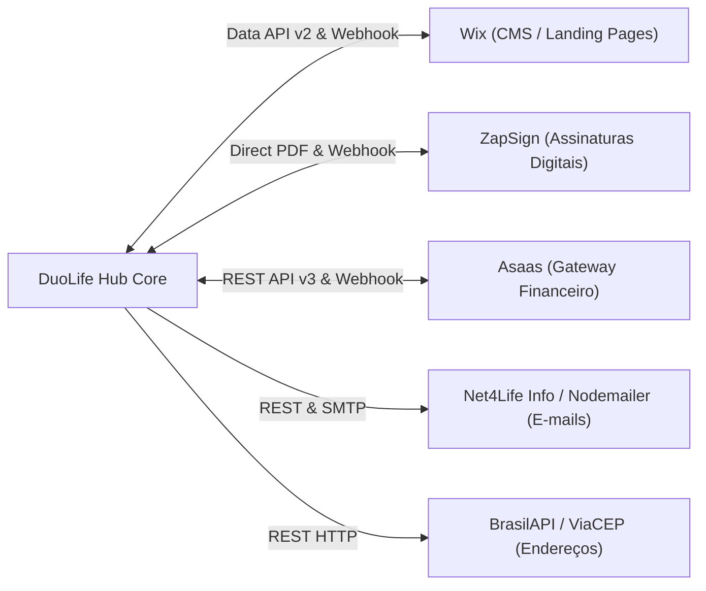

# Integrações Externas & Webhooks — DuoLife Hub

> **Status da Análise:** Fato Confirmado pelo Código-Fonte  
> **Classificação de Certeza:** Implementação técnica auditada nas bibliotecas `src/lib/` e rotas de webhook.

---

## 1. Visão Geral das Integrações

O DuoLife Hub atua como um orquestrador central integrado a múltiplos serviços de mercado para garantir a esteira automatizada de seguros:

---

## 2. Integração Wix Data API v2

### 2.1 Finalidade e Mecanismo de Conexão
- **Finalidade:** Espelhar catálogos de planos atuariais, parâmetros de comissão, cupons promocionais e importar leads originados nas landing pages.
- **Direção da Comunicação:** Bidirecional (Pull via API agendada e Push via Webhook).
- **Autenticação:** Cabeçalhos `Authorization: <WIX_API_KEY>` e `wix-site-id: <WIX_SITE_ID>` obtidos dinamicamente da tabela `system_settings` com fallback de variáveis de ambiente.
- **Biblioteca Responsável:** `src/lib/wix-client.ts`, `src/lib/wix-pull.ts`, `src/lib/wix-sync.ts`.

### 2.2 Coleções Mapeadas
| Coleção Remota | Tabela Espelho Local | Conteúdo Mapeado |
|---|---|---|
| `Import1` | `leads` / `wix_items` | Propostas e cadastros preenchidos pelo formulário institucional. |
| `Planos` | `products` / `wix_items` | Tabela de preços e coberturas vigentes para RC Advogados. |
| `Usuarios` | `partners` / `wix_items` | Corretores e parceiros cadastrados com seus códigos de venda (`wixCode`). |
| `CUPOMPROMOCIONAL`| `cupom_usos` / `wix_items` | Cupons comerciais ativos, percentuais de desconto e limites. |

### 2.3 Resiliência e Detecção de Alterações
O sistema calcula um hash SHA-256 (`payload_hash`) de cada item retornado pela API do Wix. Se o hash do item já existir idêntico na tabela local `wix_items`, a regravação é abortada, economizando operações de I/O no banco.

---

## 3. Integração ZapSign (Assinatura Eletrônica)

### 3.1 Geração Direta de Documentos em PDF (`dynamic_pdf`)
- **Diferencial Arquitetural:** O DuoLife Hub não depende de modelos estáticos pré-configurados no painel da ZapSign. O gerador vetorial `src/lib/pdf-contract-generator.ts` desenha programaticamente o documento PDF com base no plano contratado e o envia em Base64 diretamente para `POST https://api.zapsign.com.br/api/v1/docs/`.
- **Biblioteca Responsável:** `src/lib/zapsign-direct-docs.ts`.

### 3.2 Dupla Assinatura Sequencial com Âncoras Invisíveis
Para garantir a esteira jurídica formal de contratação:
1. No PDF gerado, são injetadas duas âncoras de texto em cor quase imperceptível (`#FAFAFA` / 7pt):
   - `{{assinatura_corretora}}` posicionada acima do bloco de assinatura da corretora.
   - `{{assinatura_proponente}}` posicionada acima do bloco de assinatura do cliente.
2. A ZapSign recebe a configuração de assinatura ordenada:
   - **Signatário 1 (Corretora):** `order: 1`, `signature_pattern: '{{assinatura_corretora}}'`.
   - **Signatário 2 (Proponente):** `order: 2`, `signature_pattern: '{{assinatura_proponente}}'`.
3. O cliente segurado só recebe o convite de assinatura por e-mail após a Corretora formalizar a sua rubrica digital no documento.

### 3.3 Webhook ZapSign (`/api/webhook/zapsign`)
- **Autenticação:** Validação de token em cabeçalho ou parâmetro.
- **Tratamento:** Ao receber o evento `doc_signed`, atualiza o registro na tabela `signature_documents` para `signed`, salva a URL do PDF final assinado (`signed_file_url`), avança a cotação para o status `assinado` e aciona imediatamente a emissão da cobrança no Asaas.

---

## 4. Integração Asaas (Gateway Financeiro)

### 4.1 Clientes e Métodos de Pagamento
- **Finalidade:** Emissão de cobranças bancárias e controle de recebíveis.
- **Autenticação:** Cabeçalho `access_token: <ASAAS_API_KEY>`.
- **Cadastro de Clientes:** Realiza busca prévia por CPF/CNPJ (`GET /v3/customers?cpfCnpj=...`). Se não existir, cria o cliente com a flag `notificationDisabled: true` para que o DuoLife controle integralmente as réguas de comunicação.
- **Formas de Pagamento Suportadas:**
  - **PIX Direto:** QR Code dinâmico e chave Copia e Cola.
  - **Boleto Bancário:** Linha digitável e PDF oficial de cobrança.
  - **Cartão de Crédito:** Link direto de checkout seguro.
  - **Fatura por E-mail (UNDEFINED):** Link multi-método do Asaas onde o cliente escolhe como deseja pagar.
  - **Carnês / Parcelamentos:** Emissão de cobranças parceladas em até 6x para planos superiores a 100k, mapeando cada vencimento individualmente na tabela `payment_installments`.

### 4.2 Prevenção de Anacronismo e Reconciliação (`isChargeAnachronic`)
- **Problema Histórico Solucionado:** Quando um cliente recorrente já possuía faturas antigas liquidadas no Asaas (ex: de anos anteriores), rotinas ingênuas de sincronização por CPF associavam pagamentos passados à nova cotação.
- **Blindagem Temporal:** O módulo `src/lib/asaas-sync.ts` compara o `dateCreated` e `dueDate` da cobrança contra o `created_at` da proposta. Cobranças anteriores à proposta (com margem de 24 horas) são sumariamente descartadas como **anacrônicas**, a menos que contenham o identificador explícito `externalReference === cotacao.id`.

### 4.3 Webhook Asaas (`/api/webhook/asaas`)
- **Autenticação:** Header `asaas-access-token` comparado em tempo constante (`crypto.timingSafeEqual`) contra o segredo `ASAAS_WEBHOOK_SECRET`.
- **Tratamento:** Processa `PAYMENT_RECEIVED`, `PAYMENT_CONFIRMED` e `PAYMENT_OVERDUE`. Executa a rotina transacional `ensureSaleForPaidQuote` com lock no PostgreSQL, emitindo a apólice definitiva em `sales` e creditando a comissão correspondente.

---

## 5. Serviços de E-mails Transacionais

- **Arquitetura Híbrida (`src/lib/mailer.ts`):**
  1. **Provedor Primário:** API REST da Net4Life Info / FluxoSend (`https://api.duo24horas.com.br/email_marketing/v1/send`).
  2. **Provedor Secundário (Fallback):** Servidor SMTP padrão configurado via Nodemailer (`SMTP_HOST`, `SMTP_PORT`, `SMTP_USER`, `SMTP_PASS`).
  3. **Ambiente de Desenvolvimento:** Mock silencioso em console para evitar envios acidentais a clientes reais durante testes.
- **Auditoria de Entregabilidade:** Todos os envios (sucessos e falhas com stack trace) são persistidos na tabela `email_dispatch_logs` e auditáveis pelo painel em `/admin/auditoria-emails`.

---

## 6. Consulta de CEP (BrasilAPI / ViaCEP)

- **Endpoint Local:** `GET /api/cep/[cep]`.
- **Funcionamento:** Consulta primária na BrasilAPI (`https://brasilapi.com.br/api/cep/v1/{cep}`) com fallback automático para ViaCEP (`https://viacep.com.br/ws/{cep}/json/`).
- **Normalização:** Retorna objeto unificado contendo `{ street, neighborhood, city, state, postalCode }` sanitizado.
