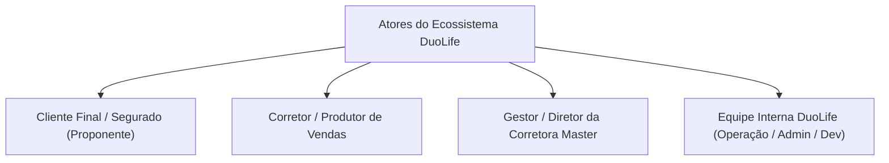

# Visão de Produto — DuoLife Hub

> **Status da Análise:** Fato Confirmado pelo Código-Fonte  
> **Classificação de Certeza:** Baseado na implementação ativa em Outubro de 2026.

---

## 1. Finalidade do Produto

O **DuoLife Hub** é uma plataforma digital de distribuição, contratação, gestão e ciclo de vida de seguros de **Responsabilidade Civil Profissional (RC)**. O produto conecta em tempo real corretores de seguros, corretoras master parceiras (como a *NET4Life Corretora de Seguros*), seguradoras/provedoras de risco (como a *KEV Seguros*) e os clientes finais (profissionais liberais e empresas tomadoras).

Seu propósito central é transformar um processo tradicionalmente burocrático, moroso e manual de contratação de seguros em uma experiência digital contínua, unificando desde a simulação de cobertura e qualificação cadastral até a assinatura eletrônica da minuta e a liquidação da cobrança bancária em minutos.

---

## 2. Problemas que o Produto Resolve

1. **Fragmentação de Ferramentas:** Elimina a necessidade de operar planilhas de cálculo, redatores externos de proposta, sistemas isolados de assinatura (portais manuais de assinatura eletrônica) e sistemas bancários desconectados.
2. **Morosidade na Emissão de Apólices:** Substitui formulários impressos por uma esteira dinâmica em 6 passos que emite contratos PDF sob demanda com âncoras milimétricas para assinatura digital.
3. **Erros de Precificação e Cálculos Fraudulentos:** Elimina o risco de manipulação de prêmios no navegador, recalculando integralmente no servidor todas as coberturas, franquias, juros de parcelamento e regras estritas de desconto (teto inegociável de 40%).
4. **Anacronismo e Amarrações Financeiras Indevidas:** Resolve problemas de gateways de pagamento (como o Asaas), impedindo que faturas antigas de clientes recorrentes sejam incorretamente associadas a novas propostas.
5. **Inadimplência e Perda de Renovações:** Automatiza a régua de relacionamento de apólices com avisos preventivos de renovação (D-60, D-30, D-15 e D-0) e cobrança de faturas em atraso (D+1, D+3, D+7, D+15).

---

## 3. Tipos de Usuários e Personas

### 3.1 Cliente Final / Segurado (Proponente)
- **Perfil:** Profissional regulamentado (advogados, escritórios de advocacia, etc.) ou tomadora de serviço.
- **Acesso:** Não possui login permanente com senha no portal. Interage através de **Links Públicos White-Label de Venda** (`/contratar/[token]`), recebe e-mails transacionais com links de proposta e faturas, e assina os contratos via interface web do ZapSign.

### 3.2 Corretor / Vendedor Parceiro (`partner_broker`, `partner_partner`)
- **Perfil:** Profissional autônomo ou vendedor credenciado a uma empresa parceira da DuoLife.
- **Acesso:** Autentica-se no **Portal do Parceiro** (`/portal`).
- **Capacidades:** Simula cotações, emite propostas personalizadas, gera links próprios com comissionamento garantido, consulta sua carteira de clientes segurados e acompanha o status de pagamento de suas apólices.

### 3.3 Diretor / Gestor de Parceria (`partner_director`, `partner_manager`)
- **Perfil:** Responsável comercial pela empresa parceira.
- **Capacidades:** Visualiza a produção consolidada de sua filial, acompanha métricas comerciais da sua equipe e cadastra corretores subordinados.

### 3.4 Gestor da Corretora Master (`corretora_admin`, `corretora_manager`, `corretora_staff`)
- **Perfil:** Administradores de corretoras integradas à DuoLife (ex: *NET4Life*).
- **Capacidades:** Gerencia seus próprios parceiros e corretores associados, acompanha vendas consolidadas sob seu CNPJ/SUSEP, visualiza minutas e contratos emitidos com a sua marca gráfica (White-Label) e confere dados bancários/PIX para repasses.

### 3.5 Operação Interna DuoLife (`duolife_staff`)
- **Perfil:** Analistas operacionais e de atendimento.
- **Capacidades:** Visualização de propostas, apólices emitidas, histórico de clientes, suporte a corretores e acompanhamento de relatórios executivos em `/admin`.

### 3.6 Administrador Geral DuoLife (`duolife_admin`)
- **Perfil:** Liderança executiva e gestores de produto.
- **Capacidades:** Credencia novas Corretoras Master com conferência de 4 documentos regulatórios obrigatórios, gerencia parceiros, tabela de produtos, aprova ou transfere cotações e executa sincronizações financeiras.

### 3.7 Desenvolvedor do Sistema (`duolife_dev`)
- **Perfil:** Engenharia de software e DBA.
- **Capacidades:** Acesso a rotas técnicas privilegiadas, auditoria em tempo real de webhooks recebidos, auditoria e preview de envios de e-mails, comparativo detalhado com bancos legados (Wix Data), importação em lote via CSV e rotinas de reset em ambiente de homologação.

---

## 4. Módulos do Sistema

| Módulo | Escopo | Finalidade Principal |
|---|---|---|
| **Esteira de Cotação Dinâmica** | Portal & Links Públicos | Formulário em 6 etapas para seleção de planos, preenchimento de perfil profissional, underwriting e seleção de pagamento. |
| **Emissão de Contratos & ZapSign** | Backend Core | Gerador vetorial de minutas em PDF com dupla assinatura eletrônica (ordem 1: Corretora, ordem 2: Proponente) via âncoras transparentes. |
| **Gateway Financeiro & Asaas** | Backend Core | Geração de boletos, PIX, cartões e carnês em até 6x, conciliação direta e prevenção de anacronismo. |
| **Gestão de Apólices & Vendas** | Admin & Portal | Registro formal de apólices ativas, histórico de vigência (1 ano), controle de prêmio emitido e comissões. |
| **Carteira de Clientes** | Admin & Portal | Visualização de segurados com busca dinâmica por CPF/Nome, histórico de propostas e parcelas. |
| **Gestão de Corretoras Master** | Admin | Cadastro corporativo com uploads obrigatórios (Contrato Social, Cartão CNPJ, RG/CNH do Sócio e Comprovante Bancário/PIX). |
| **Rede de Parceiros & Equipe** | Admin & Portal | Credenciamento de corretores, geração de links de venda com desconto parametrizado e hierarquia de gerência. |
| **Central de Sincronizações (Sync)** | Admin | Painel de monitoramento e disparo de rotinas com Wix, ZapSign e Asaas (inclusive auditoria de cotações assinadas sem fatura). |
| **Auditoria de Webhooks** | Admin | Trilha completa de eventos recebidos (Asaas, ZapSign, Wix), inspeção de payloads brutos e reprocessamento sob demanda. |
| **Auditoria de E-mails** | Admin | Monitoramento de disparos de e-mail (Net4Life Info vs Nodemailer SMTP), taxas de sucesso e testes de entrega. |
| **Régua de Ciclo de Vida** | Cronjob Backend | Varredura automatizada para avisos preventivos de renovação e cobrança de parcelas em atraso. |

---

## 5. Jornadas Principais de Produto

### 5.1 Jornada do Corretor (Emissão Assistida)
1. O corretor acessa `/portal/cotacoes/nova`.
2. Seleciona o produto (ex: **RC Advogados**) e o limite de cobertura desejado (100k, 300k, 500k, 1M, etc.).
3. Preenche os dados do cliente (ou seleciona um segurado existente no banco) e valida o endereço via CEP automático.
4. Informa o registro de classe (OAB), especialidades jurídicas, faturamento e questionário de risco.
5. Seleciona a forma de pagamento (à vista ou parcelado em até 6x) e pode aplicar desconto manual (até 40%).
6. Clica em **"Ir para Assinatura"**: o sistema grava a cotação e gera o contrato no ZapSign.
7. O corretor e o proponente recebem a notificação de assinatura.
8. Após as assinaturas, a fatura Asaas é gerada automaticamente e enviada ao cliente.
9. Na confirmação do pagamento, a apólice é emitida e a comissão é creditada.

### 5.2 Jornada do Cliente (Auto-Contratação via Link Público White-Label)
1. O cliente clica no link compartilhado pelo corretor (`https://duolife.com.br/contratar/[token]`).
2. O sistema carrega o branding personalizado da corretora mãe e os dados do corretor responsável.
3. O cliente percorre os passos de contratação simplificada.
4. Assina o contrato na ZapSign e efetua o pagamento via PIX Copia e Cola ou boleto bancário.
5. Recebe o certificado de seguro por e-mail.

---

## 6. Limitações Atuais do Produto

- **Salvamento de Rascunho Tio:** `[CONFIRMADO]` A proposta só é persistida no PostgreSQL no **Passo 5**, quando o operador clica em *"Ir para Assinatura"*. Se a conexão cair ou a página for fechada durante os Passos 1 a 4, os dados digitados são perdidos, pois não há persistência contínua (autosave) nem rascunho intermediário.
- **Visualização Mobile de Tabelas:** `[CONFIRMADO]` Apenas o módulo de *Clientes* possui layout em cards nativos para smartphones (`ClientesCardMobile`). As telas de *Cotações* e *Vendas* utilizam contêineres com rolagem horizontal (`TableScrollContainer`), exigindo rolagem lateral em telas com menos de 768px.
- **Upload Unificado de Corretora em Base64:** `[CONFIRMADO]` O cadastro de corretora master envia 4 arquivos de até 5MB em Base64 em uma única requisição HTTP POST. Em conexões móveis ou instáveis, requisições com mais de 10MB correm risco de timeout.

---

## 7. Funcionalidades Parcialmente Implementadas

- **Módulo de Comissões (`/portal/comissoes` e `/admin/comissoes`):** `[INCOMPLETO]` As tabelas do banco (`commissions`), o cálculo financeiro (`ensureSaleForPaidQuote`) e os endpoints de API existem e operam perfeitamente. No entanto, os links de navegação nos menus laterais (`PortalShell` e `AdminShell`) foram provisoriamente comentados no código da interface, aguardando alinhamento de regras comerciais da diretoria.
- **Exclusão de Registros em Produção (LGPD):** `[INCOMPLETO]` Endpoints destrutivos como `/api/admin/cotacoes/[id]` e `/api/admin/clientes/[id]` rejeitam chamadas quando `NODE_ENV === 'production'`. Não foi implementada uma rotina de anonimização ou expurgo auditado em produção para atendimento a solicitações de exclusão de dados da LGPD.

---

## 8. Funcionalidades Aparentemente Planejadas / Extensibilidade Futura

- **Multi-Ramos de Responsabilidade Civil:** `[INFERIDO]` O sistema possui arquivos de configuração e esquemas Zod completos para outros ramos profissionais em `src/lib/product-schemas/definitions/`:
  - `rc-medicos.ts` (Médicos e Clínicas);
  - `rc-odonto.ts` (Dentistas e Consultórios);
  - `rc-engenheiros.ts` (Engenheiros e Arquitetos);
  - `rc-contadores.ts` (Contadores e Escritórios Contábeis);
  - `do-executivos.ts` (D&O - Diretores e Administradores de Empresas).
  Contudo, a esteira comercial e as telas ativas em produção operam atualmente 100% voltadas para **RC Advogados** (`rc-advogados.ts`). Os demais ramos estão modelados arquiteturalmente, porém aguardam ativação de produto e tabelas atuariais das seguradoras.
