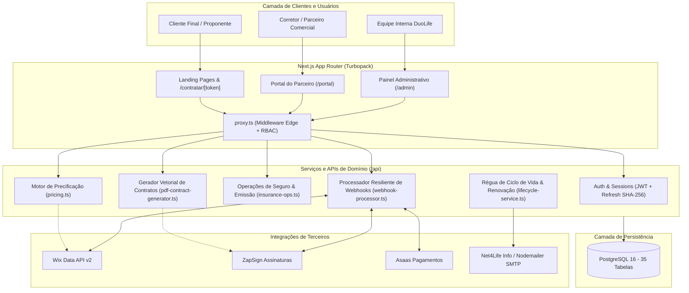

# DuoLife Hub — Documentação Técnica do Sistema

> **Estado da Análise:** Outubro de 2026  
> **Versão do Sistema:** 0.1.0 (Next.js 16.3.4 / React 19.2.4 / Tailwind CSS 4 / PostgreSQL 16)  
> **Status da Documentação:** Engenharia reversa completa baseada no código-fonte real.

---

## 1. Visão Rápida do Sistema

O **DuoLife Hub** é uma plataforma corporativa e multi-inquilino (*multi-tenant*) voltada para a cotação, contratação digital, gestão de apólices, conciliação financeira e ciclo de vida de seguros de **Responsabilidade Civil Profissional (RC)**, com ênfase inicial em **RC Advogados** e capacidade arquitetural extensível para outros ramos (Médicos, Dentistas, Engenheiros, Contadores e D&O Executivos).

O ecossistema atua como o motor central que unifica:
1. **Site Institucional e Landing Pages White-Label:** Interface pública e links de contratação direta parametrizados por corretor.
2. **Portal do Parceiro / Corretor (`/portal`):** Painel operacional para simulação de seguros, emissão de propostas, gestão de clientes segurados, acompanhamento de equipe comercial e comissões.
3. **Painel Administrativo DuoLife (`/admin`):** Central de controle corporativo para gestão de Corretoras Master, credenciamento de parceiros, monitoramento executivo de faturamento, conciliação e reconciliação bancária, auditoria de integrações e disparos transacionais.
4. **Integrações Externas Automatizadas:** 
   - **Wix Data API:** Sincronização e espelhamento bidirecional de produtos, leads e vendas legadas.
   - **ZapSign:** Geração dinâmica de minutas contratuais em PDF com esteira de dupla assinatura eletrônica (Corretora e Segurado) via âncoras invisíveis.
   - **Asaas Gateway:** Emissão automatizada de cobranças (PIX, Boleto, Cartão de Crédito e Carnês em até 6x), conciliação com prevenção de anacronismo e captura de pagamentos via webhooks atômicos.
   - **Net4Life Info / Nodemailer:** Motor transacional híbrido para notificações de propostas, faturas e réguas de relacionamento.

---

## 2. Arquitetura Resumida

---

## 3. Tecnologias Principais

| Camada | Tecnologia | Versão Confirmada | Finalidade |
|---|---|---|---|
| **Framework Web** | Next.js (App Router) | `^16.3.4` | SSR, Server Components, API Route Handlers e Turbopack |
| **Linguagem** | TypeScript / Node.js | TypeScript `^5.x` / Node `22-alpine` | Tipagem estática e runtime de execução |
| **UI & Estilo** | React / Tailwind CSS / Lucide | React `19.2.4` / Tailwind `@tailwindcss/postcss ^4` | Interface declarativa em Light Mode estrito e ícones vetoriais |
| **Banco de Dados** | PostgreSQL | 16 (via Docker / Coolify) | Banco relacional com 35 tabelas e JSONB |
| **Driver SQL** | `postgres` (Porsager) | `^3.4.9` | Cliente PostgreSQL nativo de alta performance com tagged templates |
| **Validação** | Zod | `^4.4.3` | Schemas de entrada de API, formulários e ramos de seguro |
| **Criptografia** | `jose`, `bcryptjs`, `crypto` | `jose ^6.2.3`, `bcryptjs ^3.0.3` | Assinatura JWT HS256, hash de senhas e tokens timing-safe |
| **Geração de Documentos**| `pdf-lib` | `^1.17.1` | Renderização vetorial e diagramação programática de propostas em PDF |
| **E-mails** | `nodemailer` / Net4Life API | `nodemailer ^9.0.3` | Disparos transacionais com fallback SMTP |
| **Logging** | `pino` | `^10.3.1` | Logger estruturado em JSON para telemetria e diagnóstico |

---

## 4. Estrutura da Documentação

A pasta `/docs` reúne a referência técnica completa e definitiva do estado REAL do sistema:

1. [Visão Geral & Índice (README.md)](file:///c:/Apps%20e%20Systems/Sistemas/DUOLife/docs/README.md)
2. [Visão de Produto & Negócio (PRODUCT.md)](file:///c:/Apps%20e%20Systems/Sistemas/DUOLife/docs/PRODUCT.md)
3. [Arquitetura Geral do Sistema (ARCHITECTURE.md)](file:///c:/Apps%20e%20Systems/Sistemas/DUOLife/docs/ARCHITECTURE.md)
4. [Estrutura de Diretórios e Módulos (PROJECT_STRUCTURE.md)](file:///c:/Apps%20e%20Systems/Sistemas/DUOLife/docs/PROJECT_STRUCTURE.md)
5. [Catálogo de Regras de Negócio (BUSINESS_RULES.md)](file:///c:/Apps%20e%20Systems/Sistemas/DUOLife/docs/BUSINESS_RULES.md)
6. [Papéis, Perfis e Permissões (USER_ROLES_AND_PERMISSIONS.md)](file:///c:/Apps%20e%20Systems/Sistemas/DUOLife/docs/USER_ROLES_AND_PERMISSIONS.md)
7. [Fluxos e Jornadas de Usuário (USER_FLOWS.md)](file:///c:/Apps%20e%20Systems/Sistemas/DUOLife/docs/USER_FLOWS.md)
8. [Engenharia Reversa de Banco de Dados (DATABASE.md)](file:///c:/Apps%20e%20Systems/Sistemas/DUOLife/docs/DATABASE.md)
9. [Catálogo e Contratos de API (API_CONTRACTS.md)](file:///c:/Apps%20e%20Systems/Sistemas/DUOLife/docs/API_CONTRACTS.md)
10. [Integrações Externas & Webhooks (INTEGRATIONS.md)](file:///c:/Apps%20e%20Systems/Sistemas/DUOLife/docs/INTEGRATIONS.md)
11. [Autenticação e Autorização (AUTHENTICATION_AND_AUTHORIZATION.md)](file:///c:/Apps%20e%20Systems/Sistemas/DUOLife/docs/AUTHENTICATION_AND_AUTHORIZATION.md)
12. [Auditoria de Segurança & Riscos (SECURITY.md)](file:///c:/Apps%20e%20Systems/Sistemas/DUOLife/docs/SECURITY.md)
13. [Arquitetura Frontend & UI/UX (FRONTEND.md)](file:///c:/Apps%20e%20Systems/Sistemas/DUOLife/docs/FRONTEND.md)
14. [Arquitetura Backend & Serviços (BACKEND.md)](file:///c:/Apps%20e%20Systems/Sistemas/DUOLife/docs/BACKEND.md)
15. [Estratégia e Lacunas de Testes (TESTING.md)](file:///c:/Apps%20e%20Systems/Sistemas/DUOLife/docs/TESTING.md)
16. [Tratamento de Erros & Resiliência (ERROR_HANDLING.md)](file:///c:/Apps%20e%20Systems/Sistemas/DUOLife/docs/ERROR_HANDLING.md)
17. [Observabilidade, Logs & Auditoria (OBSERVABILITY.md)](file:///c:/Apps%20e%20Systems/Sistemas/DUOLife/docs/OBSERVABILITY.md)
18. [Deploy, Infraestrutura & DevOps (DEPLOYMENT.md)](file:///c:/Apps%20e%20Systems/Sistemas/DUOLife/docs/DEPLOYMENT.md)
19. [Variáveis de Ambiente & Configurações (ENVIRONMENT.md)](file:///c:/Apps%20e%20Systems/Sistemas/DUOLife/docs/ENVIRONMENT.md)
20. [Padrões de Código & Design System (CODING_STANDARDS.md)](file:///c:/Apps%20e%20Systems/Sistemas/DUOLife/docs/CODING_STANDARDS.md)
21. [Catálogo de Dívidas Técnicas (TECHNICAL_DEBT.md)](file:///c:/Apps%20e%20Systems/Sistemas/DUOLife/docs/TECHNICAL_DEBT.md)
22. [Problemas Conhecidos & Bugs (KNOWN_ISSUES.md)](file:///c:/Apps%20e%20Systems/Sistemas/DUOLife/docs/KNOWN_ISSUES.md)
23. [Guia de Impacto de Alterações (CHANGE_IMPACT_GUIDE.md)](file:///c:/Apps%20e%20Systems/Sistemas/DUOLife/docs/CHANGE_IMPACT_GUIDE.md)
24. [Diretrizes de Desenvolvimento para IA (AI_DEVELOPMENT_GUIDE.md)](file:///c:/Apps%20e%20Systems/Sistemas/DUOLife/docs/AI_DEVELOPMENT_GUIDE.md)
25. [Glossário de Negócio e Termos Técnicos (GLOSSARY.md)](file:///c:/Apps%20e%20Systems/Sistemas/DUOLife/docs/GLOSSARY.md)
26. [Histórico e Controle de Versão (CHANGELOG.md)](file:///c:/Apps%20e%20Systems/Sistemas/DUOLife/docs/CHANGELOG.md)
27. [Relatório de Auditoria Adversarial (DOCUMENTATION_AUDIT.md)](file:///c:/Apps%20e%20Systems/Sistemas/DUOLife/docs/DOCUMENTATION_AUDIT.md)

---

## 5. Instruções de Uso por Desenvolvedores e Agentes de IA

Para atuar com segurança e precisão neste repositório:
1. **Consulte a Fonte da Verdade:** Antes de implementar código ou alterar schemas, localize o módulo em [PROJECT_STRUCTURE.md](file:///c:/Apps%20e%20Systems/Sistemas/DUOLife/docs/PROJECT_STRUCTURE.md) e consulte as regras registradas em [BUSINESS_RULES.md](file:///c:/Apps%20e%20Systems/Sistemas/DUOLife/docs/BUSINESS_RULES.md).
2. **Respeite o Princípio de Fato vs Inferência:** O código implementado descreve como o sistema *atualmente se comporta*, incluindo eventuais comportamentos legados ou inconsistências intencionais. Não altere comportamentos consolidados assumindo que sejam "bugs" sem validar contra a regra documentada.
3. **Trava de Design System:** Todo o painel é estritamente **Light Mode** (`#f7faf9`, `bg-white`, `text-gray-900`, `text-primary #0e4a5a`). Jamais introduza cards em fundos escuros (`slate-900` ou `zinc-900`).
4. **Proteção Financeira e Legal:** Toda emissão de apólice passa por lock com `SELECT ... FOR UPDATE` (`src/lib/insurance-ops.ts`) e cálculo revalidado no servidor (`src/lib/pricing.ts`). Jamais confie em valores monetários ou descontos originados no client-side.
