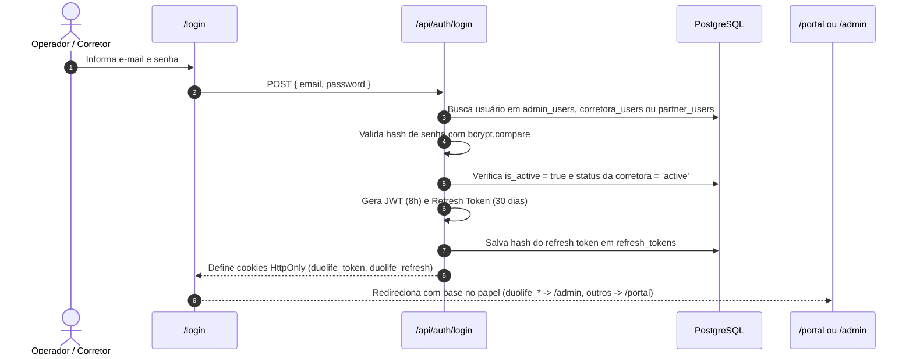
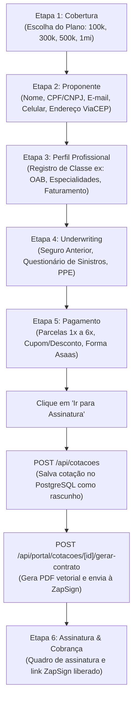
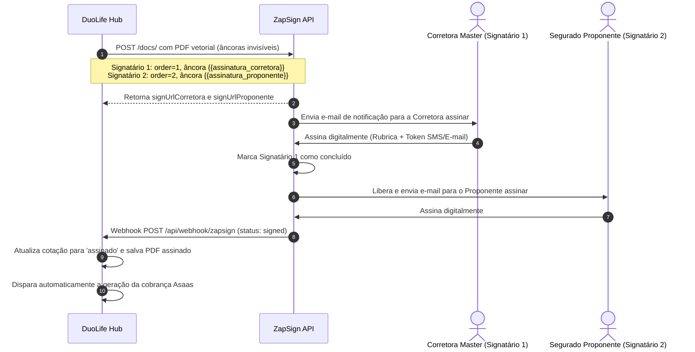
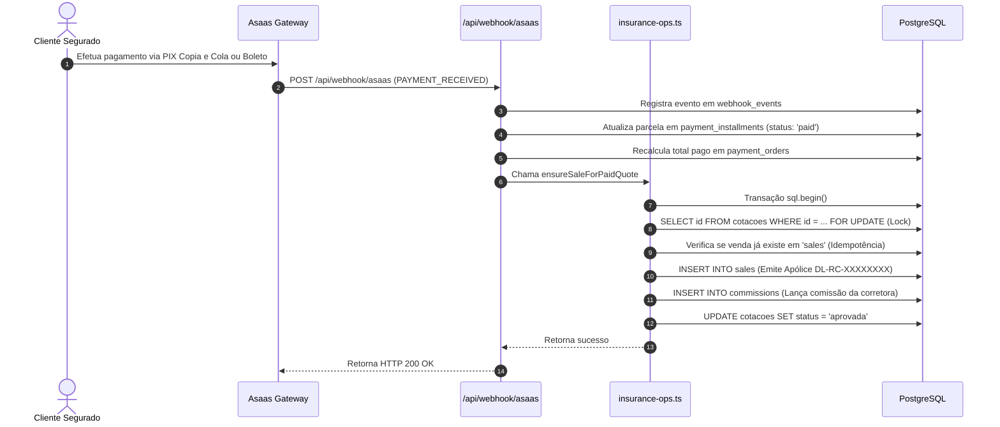
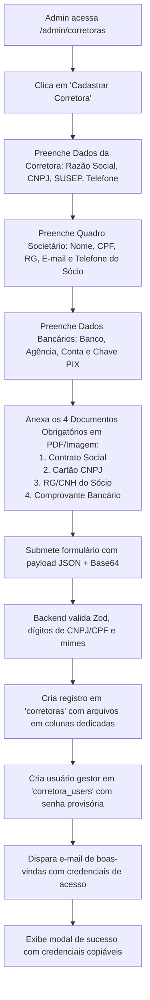

# Fluxos e Jornadas de Usuário — DuoLife Hub

> **Status da Análise:** Fato Confirmado pelo Código-Fonte  
> **Classificação de Certeza:** Jornadas reais mapeadas nos componentes de interface e serviços backend.

---

## 1. Fluxo de Autenticação e Recuperação de Senha

O fluxo de autenticação atende a todos os perfis autenticados da plataforma (Administradores, Gestores de Corretora e Corretores).



### 1.1 Recuperação de Senha ("Esqueci minha Senha")
1. O usuário acessa `/login/esqueci-a-senha` e digita seu e-mail cadastrado.
2. A rota `POST /api/auth/forgot-password` gera um token criptográfico aleatório, armazena o hash SHA-256 na tabela `password_reset_tokens` com validade de 2 horas.
3. Dispara um e-mail transacional contendo o link `https://duolife.com.br/login/redefinir-senha?token=...`.
4. O usuário abre o link, digita a nova senha (mínimo 6 caracteres).
5. A rota `POST /api/auth/reset-password` valida o token, atualiza o `password_hash` com bcrypt (10 rounds) e invalida o token com `used = true`.

---

## 2. Fluxo da Esteira Dinâmica de Cotação (6 Etapas)

Este é o fluxo principal executado em `/portal/cotacoes/nova` ou pelo formulário `DynamicCotacaoForm.tsx`.



---

## 3. Fluxo de Auto-Contratação via Link Público White-Label

Utilizado quando o corretor envia seu link personalizado para o cliente final.

```mermaid
sequenceDiagram
    autonumber
    actor Cliente as Cliente Segurado
    participant Link as /contratar/[token]
    participant PublicAPI as /api/public/contratacao/[token]
    participant Form as DynamicCotacaoForm
    participant Backend as /api/cotacoes & /gerar-contrato

    Cliente->>Link: Acessa o link compartilhado pelo corretor
    Link->>PublicAPI: GET /api/public/contratacao/[token]
    PublicAPI-->>Link: Valida validade e retorna dados da Corretora e Desconto %
    Link->>Form: Inicializa formulário com branding da corretora mãe e desconto travado
    Cliente->>Form: Preenche dados cadastrais, profissionais e escolhe pagamento
    Cliente->>Backend: Submete proposta com cabeçalho 'x-public-token'
    Backend-->>Form: Retorna cotação gravada e envelope ZapSign gerado
    Form-->>Cliente: Exibe tela de assinatura digital instantânea
```

---

## 4. Esteira de Dupla Assinatura ZapSign

Garante a validade jurídica com a assinatura prévia da Corretora Master e subsequente do Segurado.



---

## 5. Liquidação Financeira, Webhook Asaas e Emissão de Apólice

Processamento atômico de pagamento com blindagem contra duplicidade.



---

## 6. Onboarding e Credenciamento de Corretora Master

Fluxo corporativo executado pelo administrador para ativar uma nova Corretora no ecossistema.



---

## 7. Gestão de Equipe Comercial pelo Gestor

Fluxo de delegação e supervisão comercial no Portal do Parceiro (`/portal/equipe`).

1. O gestor da corretora (`corretora_admin`) acessa a aba **Equipe**.
2. Visualiza a lista de corretores ativos, quantidade de propostas emitidas e vendas confirmadas de cada membro.
3. Para cadastrar um novo corretor:
   - Clica em **"Cadastrar Vendedor / Corretor"**.
   - Preenche: Nome completo, CPF, E-mail, Celular e define uma senha inicial provisória.
   - O backend cria o registro na tabela `partner_users` vinculado à sua corretora.
   - Um e-mail de convite é disparado ao corretor com o link de acesso ao portal.
4. O gestor pode a qualquer momento: redefinir a senha do corretor, editar seus dados de contato ou suspender seu acesso alterando `is_active = false`.

---

## 8. Auditoria e Reprocessamento de Webhooks

Fluxo de suporte e diagnóstico de contingência em `/admin/auditoria-webhooks`.

1. O operador técnico acessa a Central de Auditoria de Webhooks.
2. Analisa os cards de KPI no topo: Taxa de Sucesso, Total de Eventos, Falhas e distribuição por provedor (Asaas, ZapSign, Wix).
3. Na tabela de eventos, filtra por status (`failed`) ou busca pelo ID do cliente ou transação.
4. Clica em **"Inspecionar"**: abre o modal com a visualização do JSON bruto do payload recebido e os cabeçalhos HTTP.
5. Se o erro foi causado por instabilidade transitória do banco ou timeout, clica no botão **"Reprocessar Evento"**.
6. O backend reexecuta `reprocessWebhookEvent()`, incrementa o contador `retry_count`, atualiza o status para `processed = true` e concretiza o evento pendente (ex: aprovação da venda ou avanço de status).
