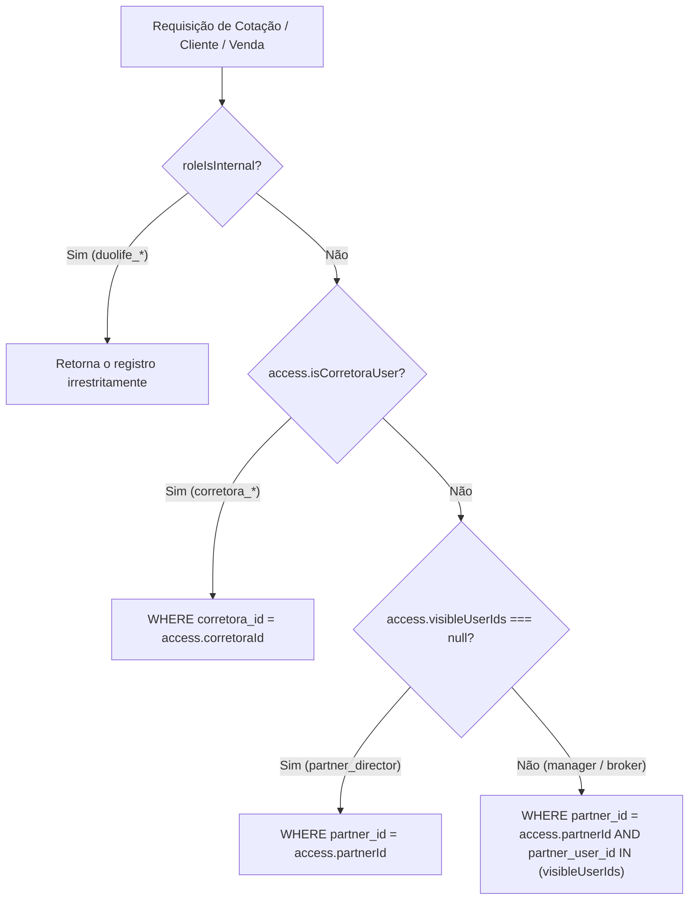

# Papéis, Perfis e Permissões — DuoLife Hub

> **Status da Análise:** Fato Confirmado pelo Código-Fonte  
> **Classificação de Certeza:** Implementação real extraída de `src/lib/roles.ts`, `src/lib/auth.ts`, `src/lib/access.ts` e `proxy.ts`.

---

## 1. Visão Geral da Matriz de Acesso (RBAC)

O **DuoLife Hub** implementa controle de acesso baseado em papéis (*Role-Based Access Control* — RBAC) com segregação hierárquica e isolamento multi-inquilino (*multi-tenant*).

O modelo é dividido em três macro-escopos contendo **10 papéis oficiais**:

1. **Escopo Interno DuoLife (Plataforma):** Usuários com visão corporativa irrestrita sobre todas as corretoras, parceiros e apólices.
2. **Escopo Corretora Master:** Usuários vinculados a uma empresa corretora credenciada (ex: *NET4Life*), com autoridade para gerenciar sua rede de corretores e acompanhar sua produção.
3. **Escopo Parceiro Comercial:** Empresas parceiras e corretores autônomos que operam a distribuição direta de seguros na ponta.

---

## 2. Relação dos 10 Papéis de Usuário

| Código do Papel (`role`) | Nome Exibido na Interface | Escopo de Acesso | Finalidade Principal |
|---|---|---|---|
| `duolife_dev` | Desenvolvedor / Engenharia | Interno | Acesso total e irrestrito. Único com permissão para operações destrutivas de homologação (`TRUNCATE`, exclusões), visualização de payloads brutos de webhooks, diagnóstico e comparativo técnico com o Wix. |
| `duolife_admin` | Administrador da Plataforma | Interno | Gestão corporativa completa: credenciamento de Corretoras Master, parametrização de produtos e comissões, transferências de carteira e reconciliação financeira. |
| `duolife_staff` | Operação e Atendimento | Interno | Suporte operacional e pós-venda. Visualiza dashboards nacionais, histórico de cotações, faturas e apólices, sem acesso a configurações críticas ou exclusões. |
| `corretora_admin` | Diretor da Corretora | Corretora | Gestor master da corretora parceira. Cadastra membros da equipe, parametriza branding, visualiza todas as vendas e cotações vinculadas ao seu CNPJ/SUSEP. |
| `corretora_manager` | Gestor da Corretora | Corretora | Supervisão comercial da corretora. Acompanha a esteira de propostas e vendas da equipe subordinada. |
| `corretora_staff` | Operação da Corretora | Corretora | Apoio administrativo interno da corretora para conferência de propostas e suporte a corretores. |
| `partner_director` | Diretor do Parceiro | Parceiro | Responsável legal pela empresa parceira. Visualiza a produção global da filial e comissões consolidadas. |
| `partner_manager` | Gestor de Vendas | Parceiro | Supervisor de corretores. Visualiza suas próprias cotações e as dos corretores sob sua gestão direta (`manager_user_id`). |
| `partner_broker` | Corretor / Vendedor | Parceiro | Corretor autônomo na ponta. Visualiza e opera exclusivamente suas próprias propostas, links e clientes. |
| `partner_partner` | Parceiro Indicador | Parceiro | Perfil simplificado de indicação/afiliação focado na divulgação de links públicos de venda. |

---

## 3. Matriz de Permissões por Recurso

A tabela a seguir consolida o acesso operacional por funcionalidade do sistema:

| Recurso / Operação | `duolife_dev` | `duolife_admin` | `duolife_staff` | `corretora_admin` | `corretora_manager` | `partner_director` | `partner_manager` | `partner_broker` |
|---|:---:|:---:|:---:|:---:|:---:|:---:|:---:|:---:|
| **Acesso ao Painel Admin (`/admin`)** | Total | Total | Restrito | Não | Não | Não | Não | Não |
| **Acesso ao Portal do Parceiro (`/portal`)**| Sim | Sim | Sim | Sim | Sim | Sim | Sim | Sim |
| **Criar Nova Cotação** | Sim | Sim | Sim | Sim | Sim | Sim | Sim | Sim |
| **Ver Cotações de Todos** | Todas | Todas | Todas | Da Corretora | Da Corretora | Da Empresa | Próprias + Equipe | Apenas Próprias |
| **Aprovar / Recusar Cotações** | Sim | Sim | Sim | Sim | Sim | Sim | Sim | Sim |
| **Gerar Contrato (ZapSign)** | Sim | Sim | Sim | Sim | Sim | Sim | Sim | Sim |
| **Gerar Fatura (Asaas)** | Sim | Sim | Sim | Sim | Sim | Sim | Sim | Sim |
| **Transferir Cotação de Carteira** | Sim | Sim | Não | Não | Não | Não | Não | Não |
| **Cadastrar Corretora Master** | Sim | Sim | Não | Não | Não | Não | Não | Não |
| **Baixar Documentos da Corretora** | Sim | Sim | Não | Não | Não | Não | Não | Não |
| **Gerenciar Equipe da Corretora** | Sim | Sim | Não | Sim | Não | Não | Não | Não |
| **Cadastrar Corretores Subordinados** | Sim | Sim | Não | Sim | Sim | Sim | Sim | Não |
| **Gerar Links Públicos de Venda** | Sim | Sim | Não | Sim | Sim | Sim | Sim | Sim |
| **Visualizar Extrato de Comissões** | Todas | Todas | Todas | Da Corretora | Da Corretora | Da Empresa | Próprias | Próprias |
| **Central de Sincronizações (Sync)** | Sim | Sim | Não | Não | Não | Não | Não | Não |
| **Auditoria de Webhooks / Reprocessamento**| Sim | Sim | Não | Não | Não | Não | Não | Não |
| **Auditoria de E-mails / SMTP** | Sim | Sim | Não | Não | Não | Não | Não | Não |
| **Comparativo Wix e Importar CSV** | Sim | Não | Não | Não | Não | Não | Não | Não |
| **Chaves de API & System Settings** | Sim | Sim | Não | Não | Não | Não | Não | Não |
| **Expurgo e Truncamento de Homologação** | Sim | Não | Não | Não | Não | Não | Não | Não |

---

## 4. Regras de Isolamento de Dados (Row-Level Security Lógico)

O isolamento entre inquilinos é aplicado na camada de aplicação através das funções `getAccessibleQuoteById` (`src/lib/access.ts`) e `getPartnerAccessContext` (`src/lib/auth.ts`):



### 4.1 Hierarquia de Equipe Recursiva (`visibleUserIds`)
Para gerentes de vendas (`partner_manager`), o sistema executa uma consulta que busca recursivamente todos os corretores subordinados vinculados através da coluna `manager_user_id` na tabela `partner_users`. O array resultante é injetado na cláusula SQL:
```sql
WHERE partner_id = ${access.partnerId}
  AND (partner_user_id IN ${sql(access.visibleUserIds)} OR partner_user_id IS NULL)
```

---

## 5. Inconsistências e Riscos de Autorização Identificados

1. **Bypass Excessivo de Token Público no Middleware (`proxy.ts`):**
   - *Evidência:* O middleware permite bypass para qualquer rota iniciada por `/api/portal/*` caso o cabeçalho `x-public-token` esteja presente.
   - *Impacto:* Rotas administrativas internas contidas sob essa árvore (como `/api/portal/equipe`) dependem exclusivamente de suas checagens internas com `verifyPartnerAuth` para barrar a chamada, gerando inconsistência de proteção entre as camadas.
2. **Restrição Indesejada em `/api/vendas` e `/api/comissoes`:**
   - *Evidência:* Ambas as rotas utilizam estritamente `verifyPartnerAuth(req)`.
   - *Impacto:* Usuários administradores internos (`duolife_admin`, `duolife_staff`) recebem erro HTTP 401 caso tentem consumir esses endpoints REST diretamente, sendo forçados a buscar dados exclusivamente via Server Components e funções analíticas de `admin-reporting.ts`.
3. **Módulo de Comissões Ocultado na Interface:**
   - *Evidência:* As rotas `/portal/comissoes` e `/admin/comissoes` estão operacionais no backend, porém os links correspondentes nos menus de navegação (`PortalShell.tsx` e `AdminShell.tsx`) estão comentados no código-fonte, bloqueando o acesso visual por parte dos usuários.
