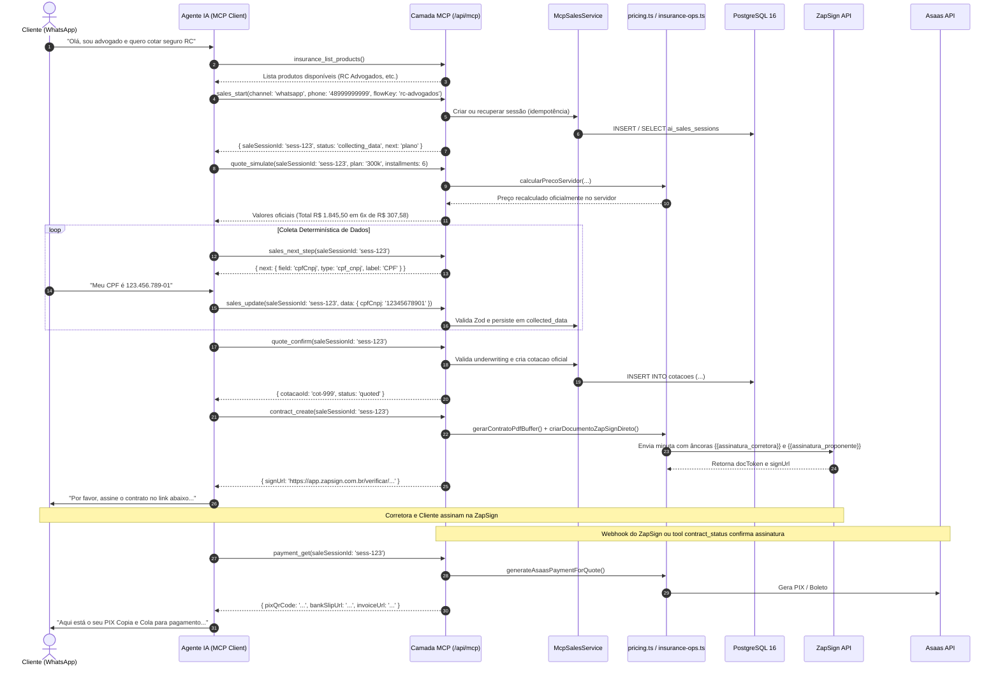

# Arquitetura da Camada MCP — DuoLife Hub

> **Status:** Especificação Técnica de Engenharia  
> **Classificação de Certeza:** Arquitetura oficial homologada para integração com agentes de IA.

---

## 1. Visão Geral da Arquitetura em Camadas

A arquitetura do servidor MCP adota o padrão de **Camadas Estritas (Layered Architecture)** com desacoplamento total entre o protocolo de transporte (JSON-RPC sobre HTTP/SSE) e a lógica de negócio do DuoLife Hub.

```
┌─────────────────────────────────────────────────────────────┐
│           Cliente MCP Externo (Agente WhatsApp / IA)        │
└──────────────────────────────┬──────────────────────────────┘
                               │ HTTP POST / SSE (/api/mcp)
                               ▼
┌─────────────────────────────────────────────────────────────┐
│                   MCP Transport / Controller                │
│    (Parse JSON-RPC 2.0, Autenticação Bearer, Rate Limit)    │
└──────────────────────────────┬──────────────────────────────┘
                               │ DTOs Validados (Zod)
                               ▼
┌─────────────────────────────────────────────────────────────┐
│                   MCP Application Services                  │
│       • McpSalesService           • McpProductService       │
│       • McpUnderwritingService    • McpAuditService         │
└──────────────────────────────┬──────────────────────────────┘
                               │ Chamadas de Funções Tipadas
                               ▼
┌─────────────────────────────────────────────────────────────┐
│                    DuoLife Domain Services                  │
│       • pricing.ts (Cálculo atuarial & parcelamento)        │
│       • insurance-ops.ts (Locks & emissão de apólices)      │
│       • product-schemas/ (Catálogo declarativo e regras)    │
│       • zapsign-direct-docs.ts (Minutas PDF e assinaturas)  │
│       • asaas-service.ts (Faturas, PIX e reconciliação)     │
└──────────────────────────────┬──────────────────────────────┘
                               │ SQL Parametrizado (Tagged Templates)
                               ▼
┌─────────────────────────────────────────────────────────────┐
│               PostgreSQL 16 & Gateways Externos             │
│    (Tabelas: ai_sales_sessions, mcp_audit_logs, cotacoes)   │
└─────────────────────────────────────────────────────────────┘
```

---

## 2. Princípios de Isolamento e Segurança

1. **Sem Acesso Genérico ao Banco:** Nenhuma tool MCP aceita comandos SQL, nomes arbitrários de tabelas ou cláusulas de filtro genéricas. Acesso a dados é feito estritamente via repositórios de domínio encapsulados.
2. **Sem Execução Arbitrária de Código:** Nenhuma tool avalia código JavaScript ou invoca comandos de shell.
3. **Sem SSRF (Server-Side Request Forgery):** Nenhuma tool recebe URLs arbitrárias do cliente para download ou chamada remota.
4. **Isolamento de Tenant e Canal:** Toda sessão de venda está vinculada ao canal emissor e às credenciais do cliente MCP autenticado.
5. **Auditoria Integral:** Cada invocação de tool é registrada na tabela `mcp_audit_logs` com medição de latência e mascaramento automático de dados sensíveis (LGPD).

---

## 3. Diagrama de Sequência — Ciclo de Vida da Sessão Comercial



---

## 4. Integração com Serviços de Domínio Existentes

A camada MCP reutiliza estritamente os serviços de domínio consolidados:

| Domínio | Serviço Reutilizado | Garantia Arquitetural |
|---|---|---|
| **Precificação** | `src/lib/pricing.ts` (`calcularPrecoServidor`) | Recálculo obrigatório no servidor. Desconto manual travado em no máximo 40%. Bloqueio de parcelamento em planos 100k. |
| **Emissão de Apólice** | `src/lib/insurance-ops.ts` (`ensureSaleForPaidQuote`) | Lock pessimista `FOR UPDATE`. Cálculo de IOF 7,38% e comissões do parceiro. |
| **Geração de Minutas** | `src/lib/pdf-contract-generator.ts` + `zapsign-direct-docs.ts` | Geração em PDF puro com âncoras invisíveis. Dupla assinatura ordenada. |
| **Gateway Financeiro** | `src/lib/asaas-service.ts` (`generateAsaasPaymentForQuote`) | Emissão exclusivamente após assinatura válida. Prevenção de anacronismo e deduplicação de carnês. |
| **Catálogo Declarativo** | `src/lib/product-schemas/` (`RAMOS_REGISTRY`) | Schemas Zod, questionários de risco e regras de validação por especialidade profissional. |
