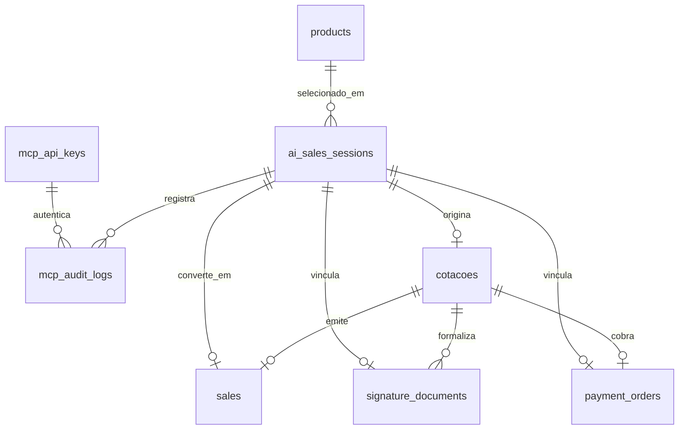

# Modelo de Dados & Migrações SQL — Camada MCP

> **Status:** Especificação Técnica de Banco de Dados  
> **Sistema Gestor:** PostgreSQL 16 (DuoLife Hub)  
> **Classificação:** Extensão Oficial de Esquema Relacional.

---

## 1. Visão Geral da Modelagem

A arquitetura de dados da camada MCP introduz **3 novas tabelas** no PostgreSQL, desenhadas com integridade referencial por chaves estrangeiras, colunas JSONB para dados dinâmicos e constraints de unicidade para garantia de idempotência:



---

## 2. Dicionário Técnico das Novas Tabelas

### 2.1 `ai_sales_sessions`
Representa uma sessão comercial de venda assistida conduzida por IA em canais externos (ex: WhatsApp).

| Coluna | Tipo | Nulo | Padrão | Descrição |
|---|---|:---:|---|---|
| `id` | `TEXT` | Não | `gen_random_uuid()::text` | Chave primária da sessão (UUID). |
| `channel` | `TEXT` | Não | `'whatsapp'` | Canal de origem do contato (`whatsapp`, `telegram`, `web_chat`). |
| `external_conversation_id` | `TEXT` | Não | — | Identificador único da conversa no canal externo (ex: número WhatsApp internacional). |
| `external_customer_id` | `TEXT` | Sim | `NULL` | Identificador do proponente no CRM ou provedor de mensageria. |
| `phone` | `TEXT` | Não | — | Telefone limpo com DDD do proponente. |
| `product_id` | `TEXT` | Sim | `NULL` | Chave estrangeira referenciando `products(id)`. |
| `flow_key` | `TEXT` | Não | `'rc_professional_v1'` | Ramo de seguro associado à sessão. |
| `status` | `TEXT` | Não | `'started'` | Estado na máquina de estados comercial. |
| `collected_data` | `JSONB` | Não | `'{}'::jsonb` | Dados atuariais e cadastrais coletados sequencialmente. |
| `cotacao_id` | `TEXT` | Sim | `NULL` | Chave estrangeira referenciando `cotacoes(id)`. |
| `signature_document_id` | `TEXT` | Sim | `NULL` | Chave estrangeira referenciando `signature_documents(id)`. |
| `payment_order_id` | `TEXT` | Sim | `NULL` | Chave estrangeira referenciando `payment_orders(id)`. |
| `sale_id` | `TEXT` | Sim | `NULL` | Chave estrangeira referenciando `sales(id)`. |
| `human_handoff_required` | `BOOLEAN` | Não | `false` | Flag indicando se a sessão foi transferida para operador humano. |
| `human_handoff_reason` | `TEXT` | Sim | `NULL` | Código padronizado do motivo do transbordo. |
| `human_handoff_notes` | `TEXT` | Sim | `NULL` | Observações técnicas contextuais para o corretor humano. |
| `last_interaction_at` | `TIMESTAMPTZ` | Não | `NOW()` | Timestamp da última mensagem ou invocação da IA. |
| `created_at` | `TIMESTAMPTZ` | Não | `NOW()` | Data e hora de criação da sessão. |
| `updated_at` | `TIMESTAMPTZ` | Não | `NOW()` | Data e hora da última modificação. |

---

### 2.2 `mcp_audit_logs`
Trilha de auditoria cronológica e imutável de todas as invocações de tools MCP.

| Coluna | Tipo | Nulo | Padrão | Descrição |
|---|---|:---:|---|---|
| `id` | `TEXT` | Não | `gen_random_uuid()::text` | Chave primária do log (UUID). |
| `request_id` | `TEXT` | Não | — | Identificador único de correlação da requisição. |
| `client_id` | `TEXT` | Sim | `NULL` | Identificador da credencial MCP (`mcp_api_keys.id`). |
| `tool` | `TEXT` | Não | — | Nome da tool invocada (ex: `quote_simulate`). |
| `sale_session_id` | `TEXT` | Sim | `NULL` | Chave da sessão afetada, se aplicável. |
| `result_status` | `TEXT` | Não | — | Resultado da chamada (`success`, `error`, `rejected`). |
| `error_code` | `TEXT` | Sim | `NULL` | Código de erro estruturado, se houver falha. |
| `duration_ms` | `INT` | Não | `0` | Tempo total de processamento em milissegundos. |
| `input_redacted` | `JSONB` | Não | `'{}'::jsonb` | Payload de entrada com mascaramento de dados sensíveis (LGPD). |
| `output_redacted` | `JSONB` | Não | `'{}'::jsonb` | Payload de resposta com mascaramento de dados sensíveis. |
| `created_at` | `TIMESTAMPTZ` | Não | `NOW()` | Timestamp exato da requisição. |

---

### 2.3 `mcp_api_keys`
Repositório seguro de credenciais de clientes MCP (Server-to-Server).

| Coluna | Tipo | Nulo | Padrão | Descrição |
|---|---|:---:|---|---|
| `id` | `TEXT` | Não | `gen_random_uuid()::text` | Chave primária da credencial (UUID). |
| `name` | `TEXT` | Não | — | Identificação humana do integrador. |
| `key_prefix` | `TEXT` | Não | — | Prefixo público da chave (primeiros 14 caracteres). |
| `key_hash` | `TEXT` | Não | — | Hash SHA-256 único da chave completa. |
| `scopes` | `TEXT[]` | Não | — | Lista de escopos autorizados. |
| `rate_limit_per_minute` | `INT` | Não | `120` | Cota de requisições por minuto. |
| `is_active` | `BOOLEAN` | Não | `true` | Situação de ativação da chave. |
| `expires_at` | `TIMESTAMPTZ` | Sim | `NULL` | Data de expiração da chave. |
| `last_used_at` | `TIMESTAMPTZ` | Sim | `NULL` | Timestamp da última chamada autorizada. |
| `created_at` | `TIMESTAMPTZ` | Não | `NOW()` | Timestamp de emissão da chave. |

---

## 3. Script SQL de Migração (`db/migrations/022-create-mcp-tables.sql`)

```sql
-- Migração 022: Criação da infraestrutura de tabelas para a Camada MCP

-- 1. Tabela de Chaves de API MCP
CREATE TABLE IF NOT EXISTS mcp_api_keys (
  id TEXT PRIMARY KEY DEFAULT gen_random_uuid()::text,
  name TEXT NOT NULL,
  key_prefix TEXT NOT NULL,
  key_hash TEXT UNIQUE NOT NULL,
  scopes TEXT[] NOT NULL DEFAULT '{}',
  rate_limit_per_minute INT NOT NULL DEFAULT 120,
  is_active BOOLEAN NOT NULL DEFAULT true,
  expires_at TIMESTAMPTZ,
  last_used_at TIMESTAMPTZ,
  created_at TIMESTAMPTZ NOT NULL DEFAULT NOW()
);

CREATE INDEX IF NOT EXISTS idx_mcp_api_keys_hash ON mcp_api_keys (key_hash) WHERE is_active = true;

-- 2. Tabela de Sessões Comerciais Assistidas por IA
CREATE TABLE IF NOT EXISTS ai_sales_sessions (
  id TEXT PRIMARY KEY DEFAULT gen_random_uuid()::text,
  channel TEXT NOT NULL DEFAULT 'whatsapp',
  external_conversation_id TEXT NOT NULL,
  external_customer_id TEXT,
  phone TEXT NOT NULL,
  product_id TEXT REFERENCES products(id),
  flow_key TEXT NOT NULL DEFAULT 'rc_professional_v1',
  status TEXT NOT NULL DEFAULT 'started',
  collected_data JSONB NOT NULL DEFAULT '{}'::jsonb,
  cotacao_id TEXT REFERENCES cotacoes(id),
  signature_document_id TEXT REFERENCES signature_documents(id),
  payment_order_id TEXT REFERENCES payment_orders(id),
  sale_id TEXT REFERENCES sales(id),
  human_handoff_required BOOLEAN NOT NULL DEFAULT false,
  human_handoff_reason TEXT,
  human_handoff_notes TEXT,
  last_interaction_at TIMESTAMPTZ NOT NULL DEFAULT NOW(),
  created_at TIMESTAMPTZ NOT NULL DEFAULT NOW(),
  updated_at TIMESTAMPTZ NOT NULL DEFAULT NOW()
);

-- Índice único condicional para idempotência de conversas ativas
CREATE UNIQUE INDEX IF NOT EXISTS idx_ai_sales_sessions_active_convo
  ON ai_sales_sessions (channel, external_conversation_id)
  WHERE status NOT IN ('cancelled', 'expired', 'policy_issued');

CREATE INDEX IF NOT EXISTS idx_ai_sales_sessions_phone ON ai_sales_sessions (phone);
CREATE INDEX IF NOT EXISTS idx_ai_sales_sessions_status ON ai_sales_sessions (status);
CREATE INDEX IF NOT EXISTS idx_ai_sales_sessions_cotacao_id ON ai_sales_sessions (cotacao_id);

-- 3. Tabela de Auditoria de Invocações MCP
CREATE TABLE IF NOT EXISTS mcp_audit_logs (
  id TEXT PRIMARY KEY DEFAULT gen_random_uuid()::text,
  request_id TEXT NOT NULL,
  client_id TEXT REFERENCES mcp_api_keys(id),
  tool TEXT NOT NULL,
  sale_session_id TEXT REFERENCES ai_sales_sessions(id) ON DELETE SET NULL,
  result_status TEXT NOT NULL,
  error_code TEXT,
  duration_ms INT NOT NULL DEFAULT 0,
  input_redacted JSONB NOT NULL DEFAULT '{}'::jsonb,
  output_redacted JSONB NOT NULL DEFAULT '{}'::jsonb,
  created_at TIMESTAMPTZ NOT NULL DEFAULT NOW()
);

CREATE INDEX IF NOT EXISTS idx_mcp_audit_logs_session ON mcp_audit_logs (sale_session_id);
CREATE INDEX IF NOT EXISTS idx_mcp_audit_logs_tool ON mcp_audit_logs (tool);
CREATE INDEX IF NOT EXISTS idx_mcp_audit_logs_created_at ON mcp_audit_logs (created_at DESC);
```
