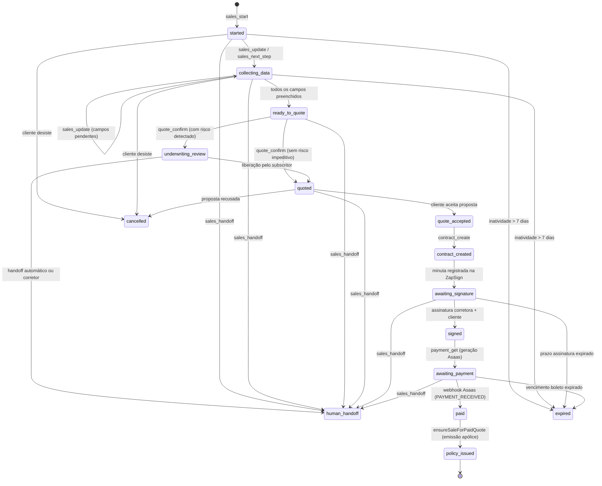
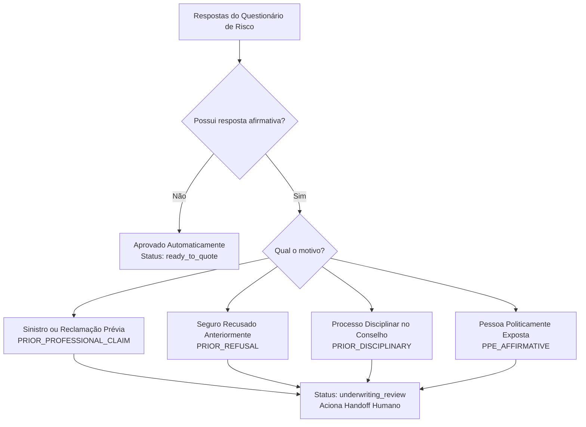

# Fluxo de Venda & Máquina de Estados — DuoLife Hub

> **Status:** Especificação de Engenharia de Processo de Negócio  
> **Classificação:** Regra de Operação Determinística do Backend.

---

## 1. Visão Geral do Ciclo de Venda Assistida

O fluxo comercial assistido por IA foi concebido para guiar o cliente do primeiro contato no WhatsApp até a liquidação bancária e emissão da apólice, mantendo a integridade regulatória da SUSEP em cada etapa.

A sessão comercial (`AI Sales Session`) é uma entidade autônoma que antecede a criação da cotação formal. Nenhuma cotação é gravada em `cotacoes` apenas pelo fato de uma conversa ter sido iniciada.

---

## 2. Máquina de Estados Finita (`AI Sales Session State Machine`)



---

## 3. Matriz Estrita de Transições Permitidas

O backend valida a transição de estados antes de qualquer mutação. Tentativas de saltar etapas ou avançar estados sem cumprir pré-condições retornam o erro estruturado `INVALID_STATE_TRANSITION`.

| Estado Atual | Transições Permitidas | Evento / Tool Gatilho | Pré-condição Obrigatória |
|---|---|---|---|
| `started` | `collecting_data`, `human_handoff`, `cancelled`, `expired` | `sales_update` | Canal e telefone válidos. |
| `collecting_data` | `collecting_data`, `ready_to_quote`, `human_handoff`, `cancelled`, `expired` | `sales_update`, `sales_next_step` | Validação Zod de cada campo preenchido. |
| `ready_to_quote` | `quoted`, `underwriting_review`, `human_handoff`, `cancelled` | `quote_confirm` | 100% dos campos obrigatórios do ramo preenchidos e válidos. |
| `underwriting_review` | `quoted`, `human_handoff`, `cancelled` | Liberação manual ou triagem | Revisão por subscritor DuoLife. |
| `quoted` | `quote_accepted`, `human_handoff`, `cancelled`, `expired` | Aceite comercial | Cotação oficial salva em `cotacoes`. |
| `quote_accepted` | `contract_created`, `human_handoff`, `cancelled` | `contract_create` | Proposta válida e preço recalculado. |
| `contract_created` | `awaiting_signature`, `human_handoff`, `cancelled` | Confirmação ZapSign | Envelope criado com 2 signatários. |
| `awaiting_signature`| `signed`, `human_handoff`, `expired`, `cancelled` | Webhook ZapSign / `contract_status` | Ambas as partes assinaram o PDF. |
| `signed` | `awaiting_payment`, `human_handoff` | `payment_get` | Contrato juridicamente assinado. |
| `awaiting_payment` | `paid`, `human_handoff`, `expired`, `cancelled` | Webhook Asaas | Fatura ou PIX registrado no gateway. |
| `paid` | `policy_issued` | Webhook Asaas | Pagamento liquidado no banco. |
| `policy_issued` | *(Terminal)* | Rotina de emissão concluída | Apólice gerada em `sales` com número `DL-RC-*`. |
| `human_handoff` | *(Bloqueado)* ou `collecting_data` se retomado | `sales_handoff` | Mutação transacional pela IA suspensa. |
| `cancelled` | *(Terminal)* | Cancelamento explícito | Não permite novas operações. |
| `expired` | *(Terminal)* | Expiração temporal | Requer nova sessão comercial. |

---

## 4. Resolução Determinística de Próximos Passos (`sales_next_step`)

O endpoint `sales_next_step` percorre a árvore de decisão declarativa do ramo para indicar o próximo dado faltante:

```
Passo 1: Seleção de Plano
   ├── tipoDePlano (100k, 200k, 300k, 400k, 500k)
   └── qtdParcelas (1x a 6x, exceto 100k estrito à vista)
         ↓
Passo 2: Dados Básicos do Segurado
   ├── nome (min 3 chars)
   ├── cpfCnpj (validação matemática com dígitos verificadores)
   ├── email (formato válido)
   ├── celular (DDD + 8 ou 9 dígitos)
   └── Endereço: cep, logradouro, numero, complemento?, bairro, cidade, uf
         ↓
Passo 3: Registro de Classe Profissional
   ├── RC Advogados: oab
   ├── RC Médicos: crm, crmUf, rqe?
   ├── RC Odonto: cro, croUf
   ├── RC Engenheiros: creaCau, creaCauUf
   └── RC Contadores: crc, crcUf
         ↓
Passo 4: Áreas de Atuação e Especialidades
   └── especialidades (ao menos 1 selecionada dentre as permitidas)
         ↓
Passo 5: Questionário de Risco e Underwriting
   └── Para cada questão do questionário do ramo:
         ├── Pergunta declarativa (Sim / Não)
         └── SE "Sim" ➔ Pergunta de detalhamento condicional obrigatória
         ↓
Passo 6: Renovação vs Seguro Novo
   ├── isRenovacao (Sim / Não)
   └── SE isRenovacao == "Sim":
         ├── seguradora
         ├── vigencia
         └── limite
```

---

## 5. Avaliação Determinística de Underwriting

A IA é proibida de aprovar ou reprovar riscos subjetivamente. O módulo `McpUnderwritingService` avalia as respostas conforme a tabela atuarial:



Quando um gatilho de risco é acionado:
1. O backend transiciona a sessão para `underwriting_review`.
2. A IA recebe a lista de códigos de motivo (ex: `PRIOR_PROFESSIONAL_CLAIM`).
3. A IA comunica ao cliente: *"A sua proposta necessita de uma análise complementar da nossa equipe técnica de subscrição devido às informações declaradas. Um dos nossos especialistas entrará em contato em breve."*
4. A IA é bloqueada de emitir contrato ou dizer se o seguro foi "recusado".
